# 온 디바이스 AIoT

상태: 진행 중
날짜: 2026년 1월 8일

# Sub PJT1

<aside>

1. 프로젝트 개요
   - [x] 프로젝트 배경
   - [x] 서브 프로젝트 개요
2. 프로젝트 목표
   - [x] 프로젝트 목표
   - [x] 서브 프로젝트 1 목표
3. AIoT 시스템 개론
   - [x] AIoT 개념
   - [x] AIoT 관련 기술
4. 라즈베리파이 5 개발 환경
   - [x] HW/SW 환경 정보
   - [x] 라즈베리파이 5 소개 및 개발 환경 설정
5. 하드웨어 모듈 제어 및 센서 활용
   - [ ] 하드웨어 모듈 제어
   - [ ] 센서 활용
6. 웹 서버 구축
   - [ ] flask를 이용한 웹 서버 구축
7. 과제 명세(라즈베리파이/웹을 통한 공공데이터 수집 및 출력)
   - [ ] 과제 목록
   - [ ] 과제 상세

[부록] 라즈베리파이 개발 환경 설정

- [ ] 개발 환경 구성
- [ ] 패키지 설치 및 관리 도구 확인
- [ ] 라즈베리파이 한글 설치
</aside>

# 1. 프로젝트 개요

- 온 디바이스 AI 기술을 활용한 임베디드 시스템을 구축하는 것

## 1) 프로젝트 배경

- 온디바이스 AI
  - 클라우드 서버가 아닌 디바이스 자체에서 AI 연산을 수행하는 방식
  - 클라우드 기반 접근 방식의 네트워크 지연, 프라이버시 문제, 높은 운영 비용등의 한계를 극복

### (1) 기술적 배경

- GPU(그래픽 처리 장치)
  - 고성능 컴퓨팅 하드웨어의 소형화와 비용절감
- 엔비디아 젯슨 오린
  - 보드의 강력한 병렬 처리
  - 딥러닝 모델의 실시간 추론이 가능
- 라즈베리파이
  - 저전력, 저비용 컴퓨팅 디바이스
  - 다양한 센서 및 모듈과의 연동이 쉬워 임베디드 시스템 개발에 널리 사용
- 라즈베리파이와 엔비디아 젯슨 오린 보드는 저비용으로 강력한 컴퓨팅 성능 제공, 다양한 센서와의 연동을 통해 실제 환경에서의 데이터 수집과 처리 가능

### (2) 소프트웨어 발전

- TensorFlow Lite, PyTorch Mobile 등과 같은 프레임워크
  - 기존의 딥러닝 모델을 소형 디바이스에서도 효율적으로 구동할 수 있도록 최적화
    ⇒ 복잡한 연산을 저전력 디바이스에서 수행

### (3) 응용 분야의 확대

- 모바일에서의 음성 인식, 증강 현실 애플리케이션, 자율 주행 자동차의 실시간 객체 인식 및 경로 계획 등 활용
- 온디바이스 A가 가지는 실시간 처리 능력과 프라이버시 보호의 장점 덕분에 지속적으로 확대

# 2. 프로젝트의 목표

## (1) 프로젝트 목표

- Sub PJT 1
  - 라즈베리파이 센서 및 하드웨어 모듈 제어
  - 웹 서버 개발 / 웹 서버를 통한 기기 제어
- Sub PJT 2
  - 젯슨 오린 나노 보드
  - 이미지 분류 AI 개발
  - 오린카 제어
- Sub PJT 3
  - 통신 시스템 개발(소켓 통신 , 웹 통신)
  - 웹서버(라즈베리파이) ↔ 오린카 제어(젯슨오린나노)
- 라즈베리파이를 통한 웹 서버, IoT 시스템 개발
- 젯슨 오린 나노 보드를 통한 온디바이스 AI 모델 개발
- 오린카 통합 제어 시스템 개발

## (2) 서브 프로젝트 1 목표

- AIoT 시스템 이해
  - 온 디바이스 ai의 기본 개념 학습
- 라즈베리파이 개발 환경 설정
  - 라즈베리파이는 소형, 저비용 컴퓨터
  - 기본 설정 방법, 운영 체제 설치, 네트워크 설정 등을 학습
- 라즈베이파이를 통한 하드웨어 모듈 제어 및 센서 활용
  - 라즈베리파이의 GPIO 핀을 활용하여 다양한 센서와 액추에이터를 제어
- Flask를 통한 웹 서버 / 페이지 구축
  - 라즈베리파이를 서버로 활용하는 방법
  - 간단한 웹 페이지 구축

# 3. AIoT 시스템 개론

## 1) AIoT 개념

- AI(인공지능) + IoT(사물인터넷)
- IoT 디바이스가 지능적으로 동작할 수 있도록 AI 기능을 통합한 시스템
- 데이터 실시간 분석, 학습, 자율적인 결정
- IoT 디바이스는 다양한 센서를 통해 데이터 수집
- 이 데이터를 클라우드나 엣지 컴퓨팅 환경에서 AI 알고리즘을 통해 분석
  ⇒ 실시간 상황 파악, 예측 모델 구축, 자율적 대응

## 2) AIoT 관련 기술

### IoT 디바이스 및 플랫폼

- IoT 디바이스
  - 다양한 센서를 포함
  - 환경에서 데이터를 수집하는 역할
  - 온도, 습도, 조도, 움직임, 가스 등 다양한 센서를 IoT 디바이스에 연결하여 실시간 정보 제공
- 플랫폼
  - IoT 플랫폼은 디바이스를 관리하고 데이터를 수집, 저장, 분석하는 통합 시스템
  - AWS, IoT, Microsoft Azure IoT, Google Cloud IoT 플랫폼 등은 IoT 플랫폼으로, 디바이스 관리, 데이터 처리, 애플리케이션 개발을 지원
  - 뛰어난 확장성, 다양한 IoT 디바이스와의 호환성을 보장

### AI 기술 및 하드웨어

- AI 기술
  - AIoT 시스템에서 사용되는 AI 기술에는 기계 학습, 딥 러닝, 자연어 처리 등이 포함
  - 기계학습 알고리즘은 대량의 IoT 데이터를 분석하여 패턴 인식, 예측 모델 생성
  - 딥러닝은 이미지, 음성 등 복잡한 데이터를 처리하여 고도의 인식 및 분석 기능 제공
  - 자연어 처리는 텍스트와 음성을 이해하고 처리하여 사용자와의 상호작용을 개선
- AI 하드웨어
  - AIoT 시스템의 성능을 향상 시키기 위해 특화된 하드웨어 필요
  - GPU, TPU, FPGA 등은 대규모 데이터를 빠르게 처리하고 AI 알고리즘을 효율적으로 실행할 수 있게 함
  - 엣지 컴퓨팅 디바이스에 내장 된 AI 칩셋은 실시간 데이터 처리를 가능하게 함

### 유무선통신 기술 및 네트워크 장비/부품

- 유선 통신 기술
  - 이더넷, 광섬유 등은 높은 대역폭과 안정성을 제공
  - 대규모 IoT 디바이스가 연결된 환경에서 중요한 역할
- 무선 통신 기술
  - wifi, bluetooth, zigbee, LoRaWAN, 5G 등 다양한 무선 통신 기술이 IoT 디바이스 간의 연결 지원
  - 5G는 초고속 데이터 전송과 저지연성 제공
    - 자율주행, 스마트 시티 등 실시간 데이터 처리가 필요한 애플리케이션에 적합
- 네트워크 장비와 부품
  - 라우터, 스위치, 게이트웨이 등 네트워크 장비는 IoT 디바이스와 클라우드 간의 데이터 전송을 관리
  - 장비는 데이터 패킷을 효율적으로 처리하고, 네트워크의 안정성과 확장성을 보장

### 보안 제품 및 솔루션

- 데이터 보안
  - AIoT 시스템에서 생성되는 데이터는 매우 민감
  - 데이터 암호화, 접근 제어, 데이터 무결성 보호 등의 기술 필수
- 네트워크 보안
  - IoT 디바이스와 클라우드 간의 통신 보호
  - 방화벽, 침입 탐지 시스템, 가상 사설망 등은 네트워크의 보안을 강화하여, 외부 공격으로부터 시스템을 보호
- 디바이스 보안
  - 펌웨어 업데이트, 보안 패치, 인증 및 권한 관리 등의 기능이 포함된 보안 솔루션은 디바이스를 보호하고, 안전하게 운영될 수 있도록 함

## (1) AIoT 기술 구현 방식

- 크게 클라우드 지능 활용과 사물 지능화로 나눌 수 있음

### 클라우드 지능 활용

- IoT 디바이스가 수집한 데이터를 클라우드로 전송하고, 클라우드에서 AI 알고리즘을 통해 데이터를 분석하고 처리하는 방식
- 클라우드의 강력한 처리 능력과 대규모 데이터 저장소를 활용할 수 있어 복잡한 데이터 분석과 고도화된 인공지능 기능을 제공하는 데 적합
  - 데이터 수집 및 전송
    - IoT 디바이스는 센서를 통해 실시간 데이터를 수집,
    - 이 데이터를 무선통신(wi-fi, 5G)을 통해 클라우드로 전송
    - 수집되는 데이터 : 온도, 습도, 조도, 위치 정보 등 ,,
  - 클라우드 저장 및 처리
    - 클라우드 플랫폼(AWS, Azure, Google Cloud)은 대규모 데이터를 저장하고 관리
    - 이 과정에서 데이터 정제, 통합, 사전 처리 작업이 수행
  - AI 분석 및 모델 학습
    - 클라우드에서 AI 알고리즘이 데이터를 분석하고, 기계학습된 딥 러닝 모델을 학습시킴
    - 클라우드의 강력한 컴퓨팅 자원(GPU, TPU)을 활용하여 복잡한 모델을 빠르게 학습
    - 실시간 분석을 통해 유의미한 인사이트 도출
      - ex) 자율주행차량 → 클라우드에서 실시간으로 교통 데이터와 센서 데이터를 분석하여 주행 경로를 최적화
  - 피드백 및 제어
    - 분석 결과는 IoT 디바이스로 전송되어 피드백 루프 형성
    - 클라우드에서 생성된 명령이나 제어 신호는 IoT 디바이스로 전송되어 디바이스 동작 조정 및 최적화

### 사물 지능화

- IoT 디바이스 자체에 AI 기능을 통합
- 데이터를 디바이스 내에서 처리학 ㅗ분석
- 엣지 컴퓨팅의 개념을 활용하여 실시간 응답성과 데이터 전송 지연 최소화
- 엣지 컴퓨팅 디바이스
  - 사물 지능화를 구현하기 위해 IoT 디바이스는 고성능 프로세서와 AI 전용 칩셋(GPU,TPU,NPU)을 내장
  - 데이터를 로컬에서 처리하고 분석할 수 있는 능력을 갖추고 있어, 클라우드에 의존 하지 않고도 실시간 의사 결정을 내릴 수 있음
- 실시간 데이터 처리
  - 사물 지능화는 데이터가 생성되는 순간부터 실시간으로 처리
  - 응답 지연을 줄이고, 즉각적인 조치를 할 수 있음
- 분산 학습 및 추론
  - 사물 지능화는 분산 학습 및 추론을 통해 AI 모델을 업데이트하고 적용
  - 엣지 디바이스는 필요에 따라 로컬에서 데이터를 학습하고, 새로운 모델을 생성
- 자율 운영
  - 사물 지능화는 IoT 디바이스가 자율적으로 동작할 수 있도록 함
  - 디바이스는 환경을 실시간으로 모니터링하고, 자율적으로 의사 결정을 내릴 수 있음
  - 특히 네트워크 연결이 불안정하거나 지연 시간이 중요한 응용 분야에서 유용
- 클라우드 지능 활용은 대규모 데이터 분석과 복잡한 AI 모델 학습에 강점을 가지며, 사물 지능화는 실시간 처리와 자율 운영에 강점을 가짐

# 4. 라즈베리파이 5 개발 환경

## 1) HW/SW 환경 정보

### (1) HW 정보

- 라즈베리파이5, 서브모터, l2C LCD, LED, 터치센서, 온습도센서, 초음파센서

### (2) SW 정보

- 활용 파이썬 라이브러리
  - RPi, GPIO
    - GPIO(General Purpose Input/Output) 핀을 제어하기 위한 파이썬 라이브러리
  - RPLCD
    - 문자형 LCD 디스플레이를 제어하기 위한 라이브러리
  - Flask
    - 파이썬으로 작성된 핵십적인 웹 기능을 제공하는 프레임워크

## 2) 라즈베리파이5 소개 및 개발 환경 설정

### (1) 라즈베리파이 소개

- 소형 저비용의 싱글보드 컴퓨터
- 크기가 작고 가격이 저렴, 다양한 운영체제를 지원
- 주요 특징
  - 크기와 비용
    - 신용카드 크기로 매우 작으며 가격이 저렴하여 많은 사람들이 접근할 수 있음
  - 성능
    - 다양한 모델이 있으며 각각의 모델은 CPU, RAM 저장공간 등에서 최적화된 성능 제공
  - 용도
    - 라즈베리파이는 교육, 홈 서버, 미디어센터, 네트워크 장치, 게임 콘솔 에뮬레이터 등 다양한 용도로 사용
  - 확장성
    - GPIO(General Purpose Input/Output) 핀을 통해 센서, 모터 등 다양한 하드웨어를 연결 → 로봇, 가상 스테이션, 스마트 홈 장치 등을 만들 수 있음
  - 운영체제
    - 라즈베리파인느 주로 Linux 기반의 운영 체제를 사용

## (2) 라즈베리파이 5 설치 및 개발 환경 설정

- 부록참고

[라즈베리파이 개발 환경 설정](https://www.notion.so/2e4e876ee2018045856eddceab2eebd8?pvs=21)

- 장비 받으면 진행

# 5. 하드웨어 모듈 제어 및 센서 활용

## 1) 하드웨어 모듈제어

### (1) 액추에이터 제어

- 액추에이터는 IoT 시스템에서 매우 중요한 구성요소
- 센서가 감지한 데이터를 기반으로 물리적인 동작을 수행하는 장치
- 컴퓨터의 명령을 실제 세계의 물리적 움직임으로 변환하는 역할
- ex) 스마트 홈 시스템에서 조명 스위치, 서모스탯, 도어락 등
  - 전기적 신호를 받아서 물리적인 작업을 수행함으로써 사용자가 원하는 행동을 실현

### 액추에이터 소개

- 사용 목적에 따라 여러 종류로 나뉨
- 에너지 형태를 변환하여 기계적 운동, 열, 음향, 전기 신호 등을 생성
- 전기적 액추에이터
  - 모터
    - 전기 에너지 → 기계적 에너지로 변환하는 장치
    - DC 모터, 스텝 모터, 서보모터 등이 대표
  - 솔레노이드
    - 전류가 흐를 때 자기장을 생성하여 선형 운동을 발생시키는 장치
    - 전자 자금장치, 밸브 제어, 릴레이 등에서 많이 사용
- 유압식 액추에이터
  - 유압 실린더
    - 유압 압력을 이용해 선형 운동을 발생시키는 장치
    - 높은 힘과 토크를 제공할 수 있어 건설장비, 산업기계, 항공우주분야에서 널리 사용
  - 유압 모터
    - 유압 에너지를 회전 운동으로 변환하는 장치
    - 높은 출력과 신뢰성을 요구하는 응용 분야에 적합
- 공압식 액추에이터
  - 공압 실린더
    - 압축 공기를 이용해 선형 운동을 발생시키는 장치
    - 유압 실린더보다 빠른 반응 속도
  - 공압 모터
    - 압축 공기를 회전 운동으로 변환하는 장치
- 열 액추에이터
  - 바이메탈 스트립
    - 두 가지 금속을 결합하여 온도 변화에 따라 휘어지는 장치
  - 팽창형 액추에이터
    - 온도 변화에 따라 팽창하거나 수축하는 물질을 이용해 운동을 발생시키는 장치
- 피에조 전기 액추에이터
  - 피에조 크리스탈
    - 전압을 가하면 변형되는 특성을 이용한 장치
    - 매우 정밀한 움직임이 필요할 때 사용
- 전자기적 액추에이터
  - 전자기 코일
    - 전류를 통해 자기장을 형성하여 운동을 발생시키는 장치

### 서보모터 구성 요소

- 모터
  - DC 모터 또는 AC 모터를 사용
  - DC 서보모터는 소형 기기와 로봇 공학에서 자주 사용
  - AC 서보모터는 대형 산업용 기계에서 사용
- 피드백 센서
  - 서보모터는 위치, 속도 및 가속도를 측정하기 위해 피드백 센서를 사용
  - 가장 일반적인 피드백 센서는 포텐셔미터 또는 앤코더
  - 포텐셔미터는 저항의 변화로 위치를 감지
  - 엔코더는 디지털 신호를 생성하여 정확한 위치와 속도를 측정
- 제어 회로
  - 서보모터는 제어 회로를 통해 모터의 동작을 제어
  - 제어회로는 모터의 전류와 전압을 저장하여 원하는 위치와 속도를 달성
  - 이 회로는 보통 PID(비례-적분-미분) 제어 알고리즘을 사용하여 정확한 제어를 제공
- 기어 박스
  - 기어 박스는 모터의 회전 속도를 줄이고 토크를 증가시키는 역할
  - 서보모터는 더 높은 토크를 제공, 정밀한 위치 제어가 가능
  - 서보모터는 입력 신호에 따라 모터의 샤프트를 특정 각도로 회전 시키는 방식으로 작동
- 입력 신호(PWM 신호)
  - 제어 신호는 주로 PWM 형태로 제공
  - PWM 신호의 듀티 사이클에 따라 서보머터의 샤프트 위치가 결정
- 피드백 루프
  - 피드백 센서는 샤프트의 현재 위치를 측정하여 제어 회로에 전달
- 제어 회로
  - 제어 회로는 목표 위치와 현재 위치의 차이를 계산하여 모터의 전류와 전압을 조정
  - 이를 통해 서보모터는 정확한 위치로 이동

# 7. 과제 명세

## 1) 과제 목록

- API(공공데이터포털 오픈 API)를 활용하여 웹 페이지와 라즈베리파이를 통해 다양한 정보 시각화하여 나타내기

## 2) 과제 상세

### 1-1. Flask 서버 만들기

### 1-2. 공공데이터 포털에서 API를 통해 데이터를 요청하고 가져오기

```jsx
import requests
from datetime import datetime, timedelta
import xmltodict

def get_base_date_time():
    """기상청 초단기예보 기준에 맞게 현재 시간에서 최신 base_date, base_time 추출"""
    now = datetime.now()
    # 초단기예보는 매시간 45분에 생성됩니다. 45분 전이면 한 시간 전 데이터를 조회해야 합니다.
    if now.minute < 45:
        target_time = now - timedelta(hours=1)
    else:
        target_time = now

    base_date = target_time.strftime("%Y%m%d")
    base_time = target_time.strftime("%H") + "30"
    return base_date, base_time

# [중요] 반드시 'Decoding'된 서비스키를 사용하세요.
keys = 'b150d9cbe83d5f93e579200b261d663a18e0dcb6db63344b013f95b1eedc61f2'
url = 'http://apis.data.go.kr/1360000/VilageFcstInfoService_2.0/getUltraSrtFcst'

def forecast():
    b_date, b_time = get_base_date_time()
    params ={
        'serviceKey' : keys,
        'pageNo' : '1',
        'numOfRows' : '1000',
        'dataType' : 'XML',
        'base_date' : b_date,
        'base_time' : b_time,
        'nx' : '55',
        'ny' : '127'
    }

    try:
        res = requests.get(url, params=params)
        # XML 데이터를 딕셔너리로 변환
        dict_data = xmltodict.parse(res.text)

        # API 결과 상태 확인 (00이 정상)
        if dict_data['response']['header']['resultCode'] != '00':
            print(f"API 호출 오류: {dict_data['response']['header']['resultMsg']}")
            return None

        # 실제 기상 데이터 리스트 추출
        items = dict_data['response']['body']['items']['item']

        # 데이터를 담을 기본 구조 (KeyError 방지를 위해 미리 초기화)
        weather_data = {'tmp': '0', 'hum': '0', 'sky': '1', 'sky2': '0'}

        for item in items:
            category = item['category']
            fcst_value = item['fcstValue']

            if category == 'T1H': weather_data['tmp'] = fcst_value
            elif category == 'REH': weather_data['hum'] = fcst_value
            elif category == 'SKY': weather_data['sky'] = fcst_value
            elif category == 'PTY': weather_data['sky2'] = fcst_value

        return weather_data

    except Exception as e:
        print(f"데이터 처리 중 오류 발생: {e}")
        return None

def proc_weather():
    dict_sky = forecast()

    # forecast()가 None을 반환했을 때를 위한 예외 처리
    if not dict_sky:
        return "날씨 정보를 불러올 수 없습니다."

    str_sky = "서울 "
    str_sky += "날씨 : "

    # 강수 형태(sky2)가 0(없음)일 때 하늘 상태(sky) 판단
    if dict_sky['sky2'] == '0':
        if dict_sky['sky'] == '1': str_sky += "맑음"
        elif dict_sky['sky'] == '3': str_sky += "구름많음"
        elif dict_sky['sky'] == '4': str_sky += "흐림"
    else:
        # 강수 형태가 있을 때
        pty_map = {'1': '비', '2': '비/눈', '3': '눈', '5': '빗방울', '6': '진눈깨비', '7': '눈날림'}
        str_sky += pty_map.get(dict_sky['sky2'], "강수 있음")

    str_sky += f"\n온도 : {dict_sky['tmp']}ºC\n"
    str_sky += f"습도 : {dict_sky['hum']}%"

    return str_sky

if __name__ == "__main__":
    print(proc_weather())
```

# Sub PJT2 - 젯슨 보드를 활용한 인공지능 신경망 구축

<aside>

1. 프로젝트 개요
   - [x] 프로젝트 배경
   - [x] 서브 프로젝트 개요
2. 프로젝트 목표
   - [x] 프로젝트 목표
   - [x] 서브 프로젝트2 목표
3. 온디바이스 AI 이론
   - [ ] 온디바이스 AI 개념
   - [ ] 온디바이스 AI 관련 기술
4. 온디바이스 AI 개발환경
   - [ ] HW/SW 환경 정보
   - [ ] 젯슨 오린 나노 보드 소개 및 설치
5. 온디바이스 AI 모델 구현
   - [ ] 딥러닝과 이미지 분류 AI 이론
   - [ ] 온디바이스 이미지 분류 AI 모델 구현
6. 오린카 AI 구현
   - [ ] 젯슨 보드와 오린카 연동
   - [ ] 오린카 제어
   - [ ] 오린카 객체 인식 주행
7. 과제 명세(신호 감지 인공지능 블랙박스)
   - [ ] 과제 목록
   - [ ] 과제 상세
   - [ ] 활용 기술 및 라이브러리
8. 프로젝트 확장 - [ ] 기타 기술 스택 및 툴 활용
</aside>

# 1. 프로젝트 개요

- 1내용과 동일

# 2. 프로젝트 목표

### 2) 서브 프로젝트 2 목표

- 젯슨 보드 이해
- 인공지능 신경망 구축
- 젯슨 보드 기반 인공지능 구현 및 테스트
- 젯슨 보드는 NVDIA의 최신 GPU 아키텍처를 기반으로 하여, 라즈베리 파이보다 훨씬 강력한 병렬 처리 능력을 제공
- 라즈베리 파이는 교육용 및 프로토타이핑에 적합한 소형 컴퓨터지만, AI 연산에 필요한 고성능 컴퓨팅 파워는 부족
- 젯슨 보드를 활용해 온디바이스 AI를 실제로 구현,구동 하는 것을 목표

1. 젯슨 보드의 기본 개념과 개발 환경 설정
2. 딥러닝의 기본 개념과 이론 이해
3. 이미지 분류 AI 원리 학습

# 3. 온디바이스 AI 이론

## 1) 온디바이스 AI 개념

- 온디바이스 AI는 AI 모델의 학습과 추론(예측)을 중앙 서버나 클라우드가 아닌, 개별 장치(device)에서 직접 수행하는 방식의 인공지능
- 디바이스는 스마트폰, 테블릿, IoT기기, 자율주행 차량 등과 같은 컴퓨팅 능력이 있는 모든 하드웨어 의미

### (1) 온디바이스 AI의 주요 장점

- 낮은 지연 시간
  - 데이터가 클라우드로 전송될 필요가 없으므로, 실시간 처리와 응답 속도가 향상
  - 특히 자율주행 차량, 드론 등 즉각적인 반응이 필요한 애플리케이션에 중요
- 개인정보 보호
  - 민감한 데이터를 클라우드로 보내지 않고 디바이스 내에서 처리하기 때문에 개인정보 유출 위험이 줄어듦
- 오프라인 기능
  - 인터넷 연결 없이도 AI 기능을 사용할 수 있음
  - 인터넷 연결이 불안정하거나 없는 환경에서도 AI 모델이 동작할 수 있음
- 에너지 효율성
  - 데이터 전송을 줄이고 디바이스 내에서 연산을 수행함으로써 에너지를 절약할 수 있음

### 2) 온디바이스 AI 관련 기술

- 모바일 AI
  - 스마트폰 얼굴 인식
    - 애플 FaceID는 아이폰에서 사용자의 얼굴을 실시간으로 인식하여 잠금 해제
    - 이 과정은 디바이스 내에서 수행
    - 얼굴 데이터는 외부로 전송되지 않아 개인 정보 보호
  - 음성 인식과 자연어 처리
    - 스마트폰에서의 음성 비서(애플의 siri, 구글의 google assitant)는 음성 명령을 디바이스 내에서 처리하여 빠른 응답을 제공
    - 일부 간단한 명령은 클라우들 데이터를 보내지 않고도 처리
  - 자율주행 차량
    - 실시간 객체 탐지
    - 경로 계획과 충돌 회피
      - 지연 시간 최소화를 위해 모든 처리가 차량 내에서 수행
  - 스마트 홈
    - 스마트 스피커
      - 아마존의 Alexa, 구글의 Nest Audio와 같은 스마트 스피커는 음성 명령을 처리, 음악 재생, 조명 제어, 온도 조절 등 다양한 작업 수행
      - 일부 명령은 디바이스 자체에서 처리 되므로 사용자는 인터넷 연결이 없는 경우에도 기본적인 기능 사용 가능
    - 스마트 카메라
      - 스마트 보안 카메라 시스템은 실시간으로 비디오 피드를 분석하여 이상 행동이나 침입 감지
      - 데이터가 외부 서버로 전송되기 전에 디바이스 내에서 이루어져 빠른 응답 제공
    - 웨어러블 기기
      - 건강 모니터링
        - 스마트 워치를 통해 심전도를 측정하고, 심박수 이상을 감지하면 즉시 사용자에게 알림 제공
      - 피트니스 트래킹
        - 상ㅇ자의 운동을 실시간으로 모니터링하고, 달리기 속도, 칼로리 소모 등을 추적
        - 디바이스 내에서 처리되므로 운동 중에도 실시간 피드백 가능
    - 산업용 IoT
      - 예지 정비
        - 공장 내 기계 장비에 부착된 IoT 센서를 통해 고장이나 성능 저하를 미리 감지하고 예방 정비 수행
      - 로봇 공정 자동화
        - 로봇 팔이 제품을 조립하거나 포장할 때, 온디바이스 AI를 통해 실시간으로 오류를 감지하고 수정
    - 드론
      - 실시간 비디오 분석
      - 지도 작성 및 탐색
    - 증강현실(AR) 및 가상현실(VR)
      - 실시간 환경 인식
      - 몰입형 경험
  # 4. 온디바이스 AI 개발 환경
  - 장비 오면 진행
  # 5. 온디바이스 AI 모델 구현
  ## 1) 딥러닝과 이미지 분류 AI 이론
  ### (1) 딥러닝이란?
  - 딥러닝은 인공지능 기술의 한 분야로, 특히 인공 신경망을 기반으로 한 심층 학습 방법론을 의미
  - 매우 복잡한 데이터에서 패턴 인식, 학습 할 수 있는 다층 신경망을 사용
  ### (2) 딥러닝의 기본 개념
  - 딥러닝은 인공신경망의 심화된 형태로, 수많은 은닉층을 통해 데이터를 처리하고 학습하는 방법론
  - 딥러닝의 핵심은 데이터에서 자동으로 특징을 추출하여 복잡한 패턴을 학습하는 능력에 있음
    - 다층 신경망 구조
      - 딥러닝 모델은 입력층에서 시작하여 여러 개의 은닉층을 거쳐 출력층에 도달
      - 각 은닉층은 이전 층의 출력을 입력으로 받아 이를 가중치와 활성화 함수로 처리하여 다음 층으로 전달
    - 가중치 조정
      - 학습 과정에서 신경망은 입력 데이터와 실제 출력값 간의 차이를 최소화 하기 위해 가중치를 조정
      - 이는 역전파 알고리즘을 통해 이루어지며, 네트워크는 반복적으로 학습을 수행하면서 점차 더 정확한 예측을 할 수 있게 됨
    - 학습 데이터
      - 딥러닝 모델은 대규모 데이터셋을 사용하여 학습
      - 학습 과정에서 모델은 데이터의 다양한 패턴과 규칙을 학습하고, 이를 바탕으로 새로운 데이터에 대한 예측 수행
    - 딥러닝은 이미지 인식, 자연어 처리, 음성 인식 등 다양한 분야에서 탁월한 성능을 보여주고 있으며, 현대 인공지능 기술의 핵심으로 자리잡고 있음

# AI 미니 프로젝트

상태: 진행 중
날짜: 2026년 1월 8일

# 개념 정리

## 시나리오

- 상품 사진 업로드
  - YOLO가 상품 객체 탐지 및 분류
  - “빨간색 니트 가디건” 인식
- 상품 정보 요청
  - LLM이 객체 정보 기반 설명 생성
  - 상품 특징, 스타일 설명 제공
- “가격 대는 어때?” 질문
  - 쇼핑 open API + CLIP 유사도 검색
  - 유사 상품 가격 정보 제공
- “더 저렴한 걸로” 요청
  - ChromaDB 벡터 검색 + 필터링
  - 예산 맞춤 추천 상품 제시
- 최종 선택
  - 구매 링크 연결
  - 실제 쇼핑몰 이동

## AI 기술 조합

| AI 기술     | AI 기능                     | 역할              | 사용 모델                                |
| ----------- | --------------------------- | ----------------- | ---------------------------------------- |
| 컴퓨터 비전 | 객체 탐지                   | 상품 인식 및 분류 | YOLOv8(DeepFashion2 데이터 셋 사전 학습) |
| LLM         | 대화형 챗봇                 | 고객 상담 및 안내 | Llama 3.2 Korean Bllossom 3B             |
| 추천        | 특징 추출, 유사도 기반 추천 | 상품 매칭 및 추천 | CLIP VIT-B/32, ChromaDB                  |

## 그 외 기술 스택

- ChromaDB
  - 상품 특징 벡터 저장 및 유사도 검색
- LangChain
  - LLM 파이프라인 구축
- Gradio
  - 사용자 인터페이스

## 비고

- 주요 챌린지
  - [ ] 상품 매칭 정확도
  - [ ] 추천 품질
  - [ ] 대화 컨텍스트 관리
  - [ ] 다중 AI 모델 파이프라인 통합
  - [ ] 실시간 벡터 검색 최적화
- 연관 산업
  - 이커머스/전자상거래
  - 패션 테크
  - 개인화 추천 서비스
  - 이미지 검색 엔진

## AI 쇼핑 어시스턴트

- 컴퓨터 비전, LLM, 추천(코사인 유사도)을 통한 쇼핑 도우미 어플리케이션
- 사용자가 패션 이미지를 업로드하면 AI가 이미지를 인식하고, 대화를 통해 맞춤형 상품을 추천

## 프로젝트 기술 스택 정리

- 검색의 핵심 : “의미를 이해하는 데이터베이스”
  - 이 시스템은 단순히 키워드를 찾는 것이 아니라, 문장의 ‘의미’를 수치(벡터)로 변환하여 검색
    - Ko-SRoBERTa(문장 임베딩)
      - 한국어 문장을 768개의 숫자로 이루어진 벡터로 변환
      - “검은색 치마” 와 “블랙 스커트”가 서로 비슷한 의미라는 것을 수학적으로 계산할 수 있게 해줌
    - ChromaDB(벡터DB) : 변환된 벡터 데이터들을 저장하고 관리하는 창고
      - HNSW 알고리즘 : 수 많은 데이터 중 가장 비슷한 것을 빠르게 찾아내는 기술
      - SQLite 기반 : 로컬 환경에서도 데이터가 사라지지 않고 안전하게 보관
- 운영의 핵심 : “AI 워크플로우 지휘자”
  - 여러 기술을 하나로 엮어 실제 서비스처럼 동작하게 만드는 역할
    - LangChain(프레임워크) : 흩어져 있는 기술(벡터 DB, LLM, 메모리)을 연결하는 ‘접착제’
      - 대화 이력 관리 : 사용자가 이전에 했던 말을 기억하여 맥락있는 대화를 이어가게 함
      - RAG(검색 증강 생성) 파이프라인 :
        - 사용자 질문 → DB 검색 → 관련 상품 추출 → LLM이 답변생성
        - 위 과정을 자동화
- 시각 지능 : “눈을 가진 AI”
  - 텍스트 뿐만 아니라 이미지를 이해하고 분석하는 기술
    - CLIP(멀티모달 모델) : 이미지와 텍스트를 동일한 공간에서 비교
      - “청바지 사진”과 “청바지”라는 단어가 같은 개념임을 이해
      - 사진으로 상품을 찾거나 설명으로 이미지를 찾는 것이 가능

### 전체 시스템 흐름도(Flow)

1. 아이템 탐지
   1. 사용자가 사진을 올리면 YOLOv8이 옷의 종류와 위치를 파악
2. 특징 추출
   1. CLIP이 해당 옷의 스타일(이미지 특징)을 벡터로 변환
3. 의미 검색
   1. Ko-SRoBERTa 와 ChromaDB를 통해 사용자의 요구사항과 가장 유사한 상품을 DB에서 찾음
4. 최종 응답
   1. LangChain이 모든 정보를 종합하여 LLM이 자연 스러운 추천 답변을 내놓도록 관리

## 질문

- Ko-SRoBERTa 의 768차원, 왜 중요할까?
  - 768차원 이라는 숫자는 모델이 문장을 해석할 때 사용하는 ‘관점(특징)의 개수’ 라고 이해
    - 다차원의 필요성
      - 우리가 “검정색 원피스”라는 단어를 이해할 때 ‘색상’, ‘형태’, ‘용도’, ‘재질’ 등 여러 면을 고려하듯이, ai는 이를 768개의 미세한 수치로 쪼개서 파악
    - 해상도의 차이
      - 차원이 너무 낮으면 “원피스”와 “드레스”의 미세한 차이를 구분하기 어려움
      - 차원이 너무 높으면 계산 속도가 너무 느려짐
      - 768차원은 성능과 효율성 사이의 ‘황금 밸런스’로 통용되는 수치
    - 수학적 의미
      - 768개의 숫자가 좌표가 되어 고차원 공간에 점을 찍음
      - 의미가 비슷한 문장들은 이 공간 안에서 서로 가까운 거리에 모이게 됨
- ChromaDB의 HNSW vs 일반검색, 무엇이 다른가?
  - 일반 검색은 “정확히 일치하는지”. HNSW는 “얼마나 가까운지”
    - 일반 검색(Exact Match)
      - “청바지”를 검색하면 “청바지”라는 글자가 포함된 것만 찾음
    - HNSW(Hierachical Navigable Small World)
      - 수백만 개의 데이터 중에서 일일이 거리를 계산하면 오래 걸림
      - HNSW는 데이터를 계층적인 구조로 연결
- LangChain 안에서 LLM은 어떤 존재인가요?
  - LLM 은 LangChain이라는 거대한 파이프라인의 한 단계이자 핵심 부품
  - LangChain은 LLM이 혼자서는 할 수 없는 일(DB검색, 대화 기억 등)을 할 수 있도록 앞 뒤에 부가적인 단계를 붙여서 연결해주는 프레임워크

# 실습 과제1\_옷 색상 인식 기능

## 대표 색상 추출 : K-Means 클러스터링

- 옷 영역을 자르면 옷 뿐만 아니라 배경이나 피부색이 섞일 수 있음
- 단순히 평균값을 내면 색이 탁해지는데, k-means를 쓰면 이미지 내에서 가장 지배적인 k개의 색상 그룹을 찾아낼 수 있음

## 색상명 변환 : HSV 색 공간 활용

- 컴퓨터는 RGB 로 이해하지만, 사람은 “빨간색”으로 이해함
- 이를 위해 HSV(Hue, Saturation, Value) 변환이 필요
  - Hue(색상)
    - 0~360 사이의 각도로 색의 종류를 결정
  - Saturation(채도)
    - 색의 선명도
  - Value(명도)
    - 색의 밝기

## 단계별 과정

### 1단계 : 바운딩 박스 영역 자르기(crop_image_by_bbox)

- YOLO가 “여기에 옷이 있다”라고 알려준 좌표(bbox)를 이용해 이미지의 특정 부분만 도려내는 과정
- 옷의 가장 자리에는 배경이 섞일 수 있으므로, 슈도 코드보다 조금 더 정밀하게 안쪽 영역만 잘라내는 것이 좋음

```jsx
def crop_image_by_bbox(image, bbox):
    x1, y1, x2, y2 = map(int, bbox)
    img_np = np.array(image)

    # [Tip] 배경 간섭을 줄이기 위해 박스 크기를 10~20% 정도 안쪽으로 조절합니다.
    h, w = y2 - y1, x2 - x1
    cropped = img_np[y1+int(h*0.1):y2-int(h*0.1), x1+int(w*0.1):x2-int(w*0.1)]

    return cropped
```

### 2단계 : 대표 색상 추출(extract_dominant_color)

- 잘라낸 영역 안의 수 많은 픽셀 중 가장 많이 쓰인 색상을 찾는 과정
- 단순히 평균을 내면 색이 탁해지므로, K-Means 알고리즘으로 색상을 그룹화

```jsx
def extract_dominant_color(cropped_region):
    # 픽셀 데이터를 1차원 리스트로 펼치기 [R, G, B]
    pixels = cropped_region.reshape(-1, 3)

    # 3개의 주요 색상 그룹으로 묶기
    kmeans = KMeans(n_clusters=3, n_init=10)
    kmeans.fit(pixels)

    # 가장 픽셀 수가 많은 그룹의 중심점(대표 RGB) 반환
    counts = np.bincount(kmeans.labels_)
    dominant_rgb = kmeans.cluster_centers_[np.argmax(counts)]

    return dominant_rgb
```

### 3단계: 한국어 색상명 변환(convert_color_to_name)

- 추출된 RGB 값을 우리가 부르는 “빨간색”, “파란색” 등의 단어로 변환
- HSV 색 공간을 이용하면 훨씬 분류가 쉬워짐

```jsx
def convert_color_to_name(rgb):
    # RGB를 OpenCV용 HSV 포맷으로 변환
    rgb_uint8 = np.uint8([[rgb]])
    hsv = cv2.cvtColor(rgb_uint8, cv2.COLOR_RGB2HSV)[0][0]
    h, s, v = hsv # Hue(색조), Saturation(채도), Value(명도)

    # 1. 무채색(검정, 흰색, 회색) 먼저 판별
    if v < 50: return "검정색"
    if s < 40: return "흰색" if v > 200 else "회색"

    # 2. 색상(H) 각도에 따른 판별 (0~180)
    if h < 10 or h > 165: return "빨간색"
    elif 10 <= h < 22: return "오렌지색"
    elif 22 <= h < 35: return "노란색"
    elif 35 <= h < 80: return "초록색"
    elif 80 <= h < 140: return "파란색"
    elif 140 <= h < 165: return "보라색"
    return "유색"
```

## 색상 추측 변화

### 1. 초록 → 노란색으로 예측

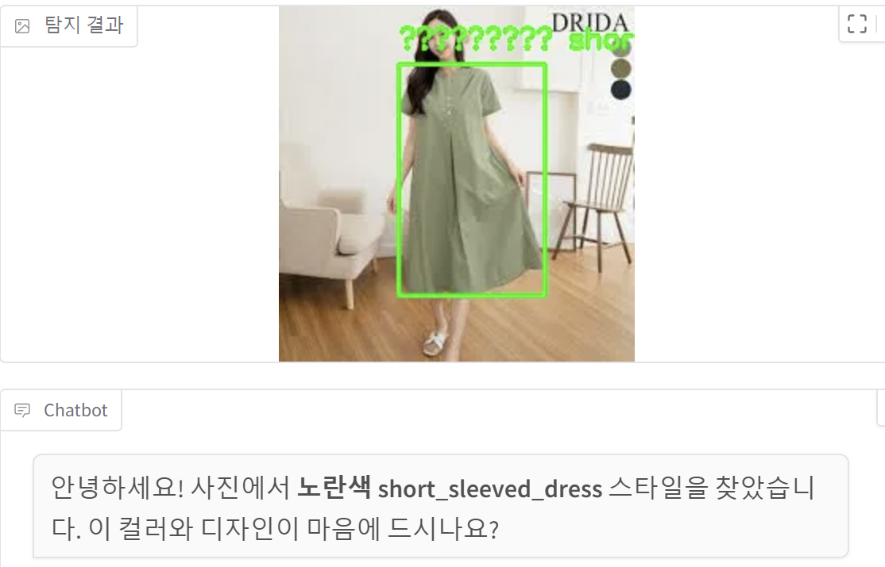


- HSV 색 공간에서 색조의 경계값이 실제 옷의 색감 보다 높게 설정
- Open CV에서 Hue 값은 0~180 사이의 각도로 표현
- 현재 코드에서 노란색과 초록색의 경계가 35로 잡혀있는데, 연두색이나 밝은 초록색은 이보다 낮은 값(25~30)을 가질 때가 많음
- 수정가이드
  - convert_color_to_name
    - 기존 : 노란색(22~35), 초록색(35~80)
    - 수정안 : 노란색 범위를 줄이고, 초록색 시작점을 앞으로 당김
    - 수정 결과
      
      
      
- 수정 결과
  - 연한 초록 → 노랑 으로 예측하는 경우는 개선
  - 하지만 진한 초록 → 파랑으로 예측 하는 경우가 생김
  - 초록의 범위를 줄여주면 되지 않을까하는 예측
    - 진한 초록이 파란색으로 인식 되었다는 것은, 해당 옷의 색조 값이 현재 설정된 초록색의 종료 지점을 넘어섰다는 뜻
    - 따라서 종료 지점을 낮추는 것이 아니라 오히려 초록색의 범위를 파란색 쪽으로 더 늘려야 함
    - 추천 방법
      - ## Hue 범위 재조정
      - 진한색의 특성 고려 : 명도 튜닝
        - 진한 초록은 명도가 낮아서, 색이 어두워지면 컴퓨터는 색상을 정확히 구분하기 힘들어하고 푸른 기운을 더 강하게 느끼는 경향이 있음
        - 명도가 낮은(V<100)구간에서는 H범위를 조금 더 유연하게 적용하거나, ‘진한 초록’을 위한 별도 조건을 만들 수 있음
      - k-means 클러스터 개수 최적화
        - 색상을 더 잘게 쪼개서 분석한 뒤, 가장 비중이 높은 것을 선택하면 “그늘 때문에 파랗게 보이는 픽셀”의 간섭을 줄일 수 있음
      - 조명 노이즈 제거 : 채도 필터링

# 실습과제2\_예산 맞춤 가격 필터링 기능

## 요구사항

- [ ] 텍스트 자연어 처리를 위한 3~4가지 주요 패턴 적용하여 가격 조건 처리
  - [ ] 정규표현식 활용 : 한국어 패턴 매칭을 위한 regex 라이브러리 사용
  - [ ] 숫자 추출 : 10만원 → 100000 변환 로직 구현
  - [ ] 동적인 기준 : “더 저렴한” 등을 요청하는 경우 이전 검색 결과의 평균가 등을 기준으로 필터링
- [ ] 검색 결과에 조건에 따른 가격 필터 적용
- [ ] 가격을 낮은 순으로 정렬하여 표시

## 1. 정규표현식

- 사용자의 자유로운 문장 속에서 “숫자”와 “만원”, “이하” 같은 핵심 패턴만 뽑아내기 위한 필수 도구

**학습 포인트:**

- `\d+`: 하나 이상의 숫자를 찾는 기호.
- `\s*`: 공백이 있을 수도 있고 없을 수도 있음을 의미.
- `()` (Grouping): 찾은 문자열 중 특정 부분(숫자 등)만 따로 추출하는 방법.
- `re.search()` vs `re.match()`: 문장 중간에 있는 키워드를 찾을 때는 `search`를 사용합니다.

## 2. 데이터 타입 변환 및 단위 정규화(Normalization)

- 사용자는 “10만원”, “15000원”, “2만5천원” 등 다양한 방식으로 말함
- 이를 컴퓨터가 계산할 수 있는 정수 형태로 통

**학습 포인트:**

- **문자열 슬라이싱 및 치환:** "만원"이라는 글자를 제거하고 숫자로 바꾸는 법.
- **단위 연산:** 추출된 숫자 `10`에 `10000`을 곱해 `100000`으로 만드는 로직.
- **예외 처리:** 숫자가 없는 문장이 들어왔을 때 에러가 나지 않게 하는 법.

## 3. 리스트 필터링과 정렬

- 검색 결과(상품 리스트) 중에서 조건에 맞는 것만 남기고 순서를 바꾸는 과정

**학습 포인트:**

- **List Comprehension:** `[item for item in list if condition]` 형식을 사용해 조건에 맞는 상품만 빠르게 골라내는 법.
- **Lambda와 Sort:** `list.sort(key=lambda x: x['price'])`와 같이 딕셔너리의 특정 키(가격)를 기준으로 정렬하는 법.
- **데이터 타입 주의:** API 결과로 받은 가격이 '문자열'일 경우, 비교 전에 반드시 `int()`로 변환해야 합니다.

## 4. 상태 유지와 컨텍스트(Context) 이해

- “더 저렴한거 보여줘” 라는 말에는 “이전 결과보다” 라는 숨은 의미가 있음
- 이를 처리하려면 이전 상태를 기억

**학습 포인트:**

- **전역 변수 또는 세션 관리:** 이전 검색 결과의 평균 가격을 어딘가에 저장해두는 방식.
- **상대적 기준 설정:** "더 저렴한"의 정의를 어떻게 내릴 것인가? (예: 이전 평균가 x 0.8 이하).

## 단계별 과정

### 1단계 : 정규표현식 및 파싱 로직 구현

- 사용자의 말에서 “금액”과 “조건”을 뽑아내는 함수

```jsx
import re

# 이전 검색 결과의 평균 가격을 저장할 전역 변수 (동적 필터용)
last_avg_price = 0

def parse_budget_request(message):
    """
    사용자의 메시지에서 예산 관련 패턴 4가지를 분석하여 정수로 변환합니다.
    """
    global last_avg_price
    budget_info = {"max_price": float('inf'), "is_budget_query": False}

    # 패턴 1: "N만원 이하", "N만원 까지"
    under_manwon = re.search(r'(\d+)\s*만원\s*(이하|까지)', message)
    # 패턴 2: "예산 N만원"
    budget_manwon = re.search(r'예산\s*(\d+)\s*만원', message)
    # 패턴 3: "N원 이하" (단위가 '원'인 경우)
    under_won = re.search(r'(\d+)\s*원\s*(이하|까지)', message)
    # 패턴 4: "더 저렴한", "더 싼" (동적 기준)
    cheaper_request = re.search(r'더\s*(저렴한|싼|저렴하게|싸게)', message)

    if under_manwon or budget_manwon:
        val = int(under_manwon.group(1) if under_manwon else budget_manwon.group(1))
        budget_info["max_price"] = val * 10000  # 만원 단위를 원으로 변환
        budget_info["is_budget_query"] = True

    elif under_won:
        val = int(under_won.group(1))
        budget_info["max_price"] = val
        budget_info["is_budget_query"] = True

    elif cheaper_request and last_avg_price > 0:
        # "더 저렴한" 요청 시 이전 평균가의 80%를 상한선으로 설정 (동적 기준)
        budget_info["max_price"] = last_avg_price * 0.8
        budget_info["is_budget_query"] = True

    return budget_info
```

### 2단계 : 필터링 및 정렬 로직 구현

- 추출된 예산 정보를 바탕으로 상품 리스트를 가공

```jsx
def apply_budget_filter(products, budget_info):
    """
    1. 예산 이하 상품 필터링
    2. 가격 낮은 순으로 정렬
    """
    if not products:
        return []

    # 1. 필터링 (lprice는 네이버 API에서 문자열로 오므로 int 변환 필요)
    filtered_products = [
        p for p in products
        if int(p.get('lprice', 0)) <= budget_info["max_price"]
    ]

    # 2. 정렬 (가격 낮은 순)
    filtered_products.sort(key=lambda x: int(x.get('lprice', 0)))

    return filtered_products
```

### 3단계 : 기존 채팅 응답 함수(chat_response)에 통합

- 기존의 챗봇 로직에 위 기능들을 연결

# 이슈 대응

- 오만원 → 5만원 인식 차이 오류
  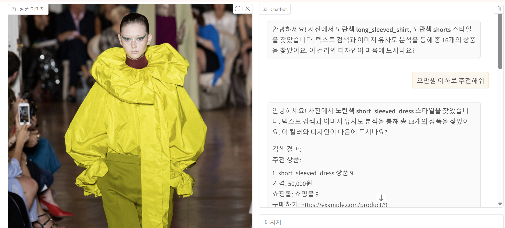
  - 오만원 이하로 추천해달라 했을 때, 가져온 데이터에는 오만만원 이하 가격의 데이터가 있음에도 불구하고, 필터링 되지 않는 오류
    
- 원인 : "오만원" vs "5만원”
  - 작성해 드린 `parse_budget_request` 함수는 `\d+`(숫자)를 찾도록 되어 있음
  - 그런데 사용자가 "오만원"이라고 한글로 입력하면 정규표현식이 숫자를 찾지 못해 `budget_info`가 `None`이 되고, 필터링 로직 자체가 실행되지 않는 것

# 🛠️ AI 서비스의 개발과 배포

## MLOps

- AI 모델의 배포, 모니터링, 유지보수를 간소화하는 방법론

## MLflow

- ML의 실험, 재현성, 배포를 포괄적으로 관리하는 오픈소스(솔루션, 프레임워크)

### + 데이터 셋 & 모델

- 데이터 자체를 데이터 셋이라고 표현
- 데이터 셋 자체를 가지고 학습시키고, 나온 결과가 모델

## 오류

- pillow 관련
  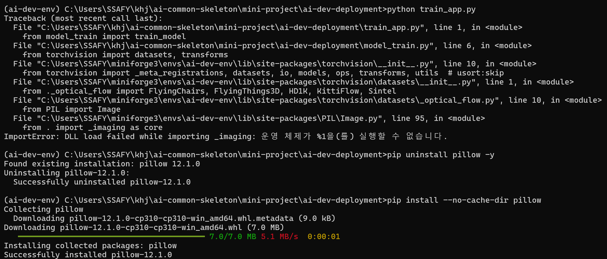
  이런 오류가 난다면 pillow 지우고 재설치!!

## DVC

- AI PJT의 데이터 셋과 모델 파일들을 Git 처럼 버전 관리하는 오픈소스
- 깃처럼 데이터와 모델을 별도 관리

## Bento ML

- Production에 배포하기 위한 오픈소스
- 벤토는 도시락
- AI API로 변경해서 쓸 수 있도록 자동화 되어있는 솔루션(핵심 기능)
- 모델을 API화 하고, 그 모델을 돌리면서 최적화까지 할 수 있는 일종의 플랫폼

# 도커 필기

- 노트에 필기해서 이미지로 첨부하겠습니다!
  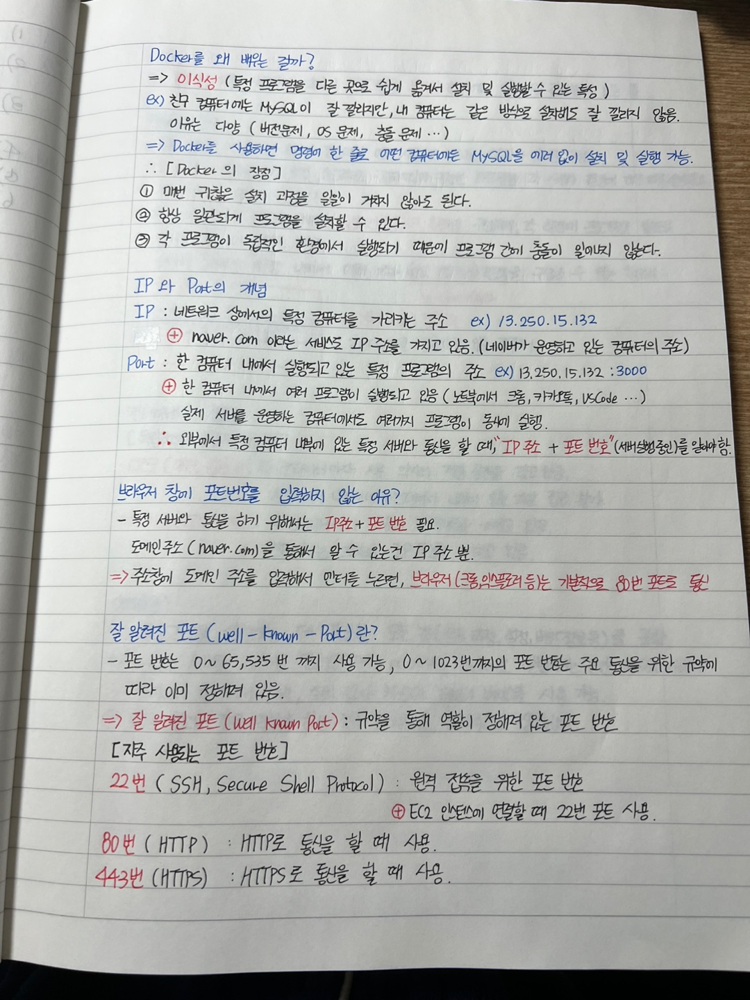
  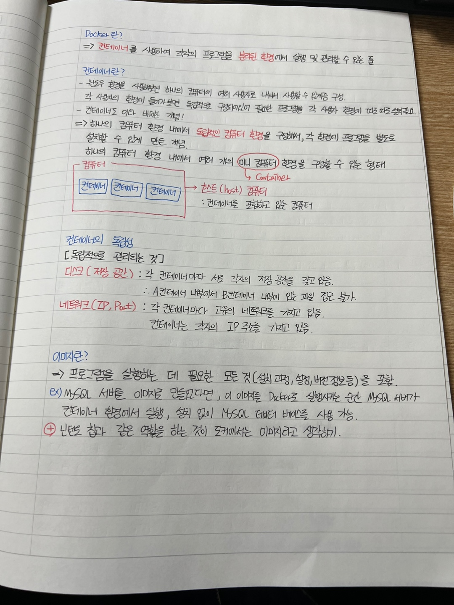
  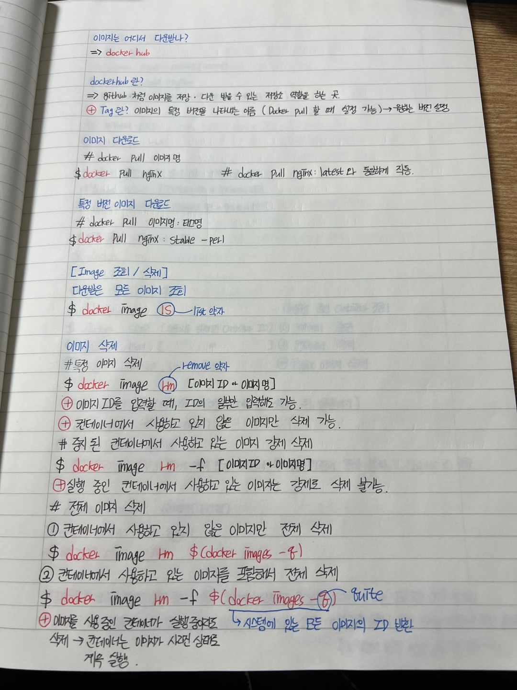
  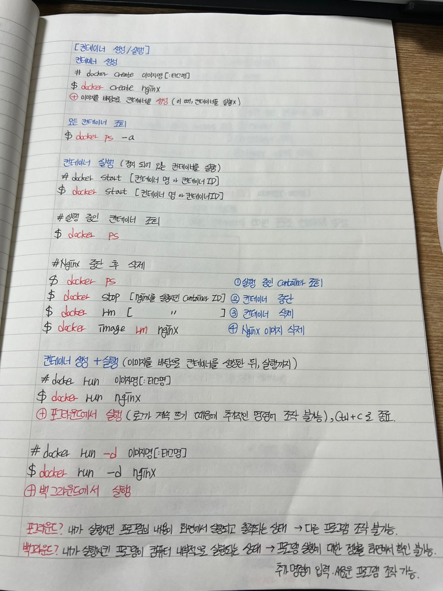
  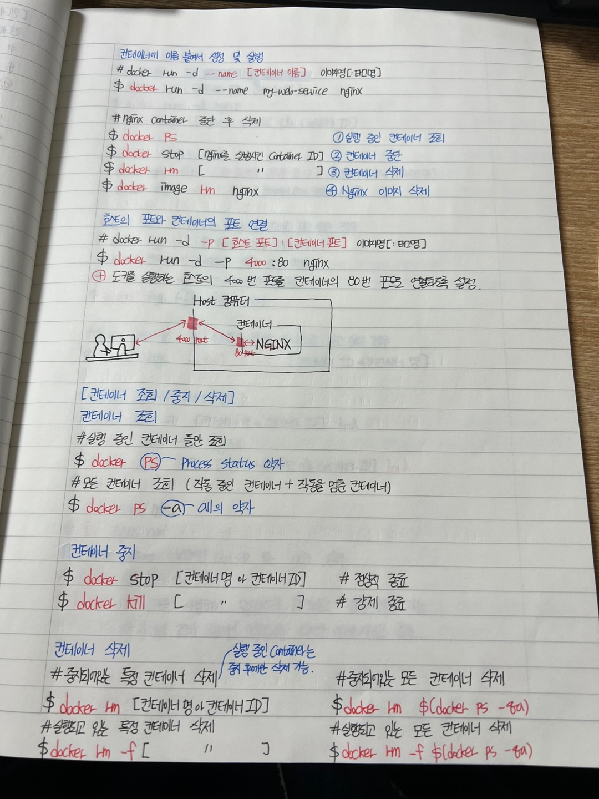
  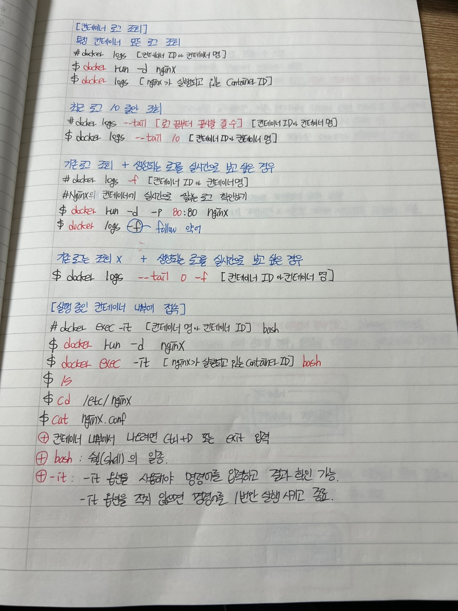
  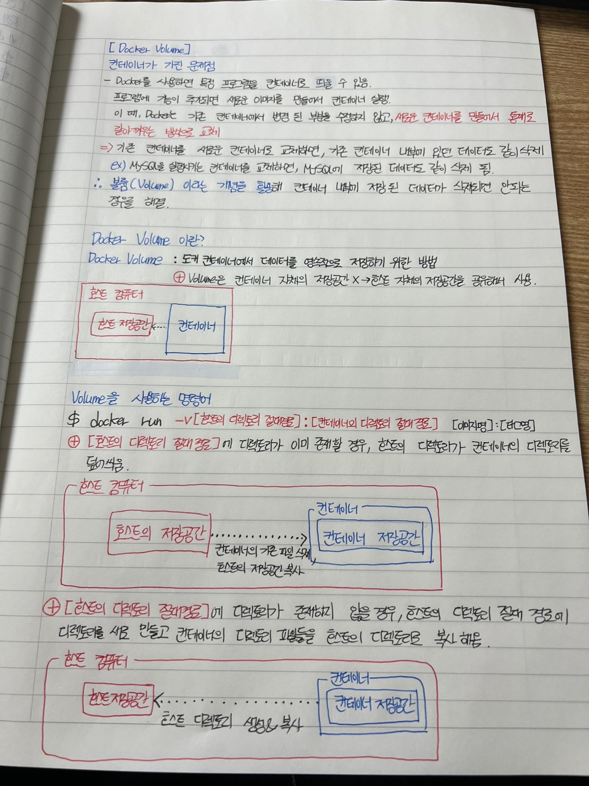

# 바리바리 시장조사\_희정

## **1. 자료 설명**

---

# 휠체어 이용 승객 자료 조사

## 대한항공-무료

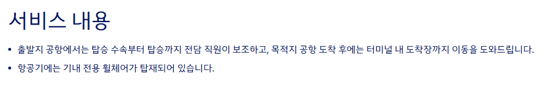

- 출발지 : 탑승 수속 + 탑승까지 전담 직원
- 목적지 : 터미널 내 도착장까지 이동
-
- 수속 밟고, 보안검색대 통과 후에 탑승 게이트까지 전담 직원이 직접 짐을 끌면서 휠체어를 미는게 어렵지 않을까

### [실제 이용 후기 1](https://blog.naver.com/jyp0813/223737535323)


### [실제 이용 후기 2](https://blog.naver.com/yunique25/223564563127)


- 기다렸다가 시간 맞춰서 들어감


- **출국 심사를 따로 받는다.**


- **면세품은 포기해야 한다.**


- **직원의 고충**
- **요약**
  - **댄공은 미리 신청하면 휠체어 탈 수 있음**
  - **카운터에서부터 탑승 바로 전까지 쭉 데려다 주심**
  - **교통약자우대 받으면서 가는 경우 보딩 시작 시간 맞춰서 교통약자우대 출구로 통과(직원과 동행)**

### [실제 이용 후기 3](https://irformation.tistory.com/entry/%EB%8C%80%ED%95%9C%ED%95%AD%EA%B3%B5-%ED%9C%A0%EC%B2%B4%EC%96%B4-%EC%84%9C%EB%B9%84%EC%8A%A4%ED%95%9C%EA%B0%80%EC%A1%B1-%EC%84%9C%EB%B9%84%EC%8A%A4-%EC%9D%B4%EC%9A%A9%ED%9B%84%EA%B8%B0)

1. 휠체어 서비스 대상
   1. 보호자 없이 여행하는 70세 이상 승객
   2. 만 7세 미만의 유소아 2명 이상을 동반한 1인 승객
2. 휠체어 서비스 제공 공항
   1. 미주(괌 제외)
   2. 유럽(런던, 파리, 프랑크 푸르트)
   3. 시드니, 오클랜드, 브리즈번
   - **제공하지 않는 공항도 있음**
3. 휠체어 서비스 이용 방법

   1. 사전 신청, 체크인 시에도 신청 가능
   2. 휠체어 서비스는 1)탑승구, 2) 항공기 문앞 3) 기내좌석까지 구간 설정 가능
   3. 공동운항편(델타항공 예약 후 대한항공 코드쉐어 항공편)인 경우 서비스 이용 불가

      (델타항공 예약자는 델타 항공사의 서비스를 이용)

   - **1)탑승구 구간 까지 설정 후 바리바리를 이용한다면 면세점을 이용할 수 있을 듯!!**

   

   [신청 절차 참고 링크](https://blog.naver.com/jwh_90/223330240977)

4. 입국수속 및 짐찾기
   1. 휠체어 서비스 직원이 입국 수속 및 짐찾기까지 다 도와줌
   2. 물론 입국수속에 대한 질문은 스스로 답변, 휠체어 직원이 통역 x
   3. 입국 수속을 마치면 짐까지 찾아서 출국장으로 같이 이동
5. 스탑오버로 타 항공편으로 갈아타야 할 떄
   1. 대한항공 → 타 항공사 : 직원이 연결편 탑승구까지 함꼐 동행, 단 해당 공항에 직원이 함께 이동하기 어려운 경우, 동행 가능한 최종 지점 까지만 서비스 이용 가능
   2. 다른 항공사 → 대한항공 : 대한항공 탑승수속 카운터에 도착한 시점부터 휠체어 서비스를 이용 가능

### [실제 이용 후기 3](https://blog.naver.com/jwh_90/223330240977)

## [에어부산](https://m.airbusan.com/mc/common/service/customer/together)(투게더 서비스)-유료(국내선 3만, 국제선 5만)


- **국제선의 경우 왕복 10만원의 비용 부담**


- **개인 용무 수행 및 동행 불가**
- **특히 개인 수하물 운반 대행 등 불가 → 우리 서비스를 이용하면 가능!!!!!!!**
- [관련 기사 링크](https://www.yna.co.kr/view/AKR20150419011600051)
  
  - 교통 약자인 장애인들이 항공기를 편리하고 안전하게 이용할 수 있도록 한다지만, 공항에서 서비스(면세점 쇼핑, 식)를 누리지 못하고 있는 상황

### [실제 이용 후기 1](https://blog.naver.com/wendybella/223036344272)


- **직원이 직접 캐리어와 휠체어를 같이 끌어줌**
- **교통약자전용 게이트는 모두 동일**

### 정리

- LCC 항공사라서 이용 후기가 별로 없음
- 유료
- 항공사 상관 없이 교통약자전용 게이트는 교통약자 서류가 있으면 통과 가능한 것으로 보임

## 진에어 - 별도로 이동을 도와주는 서비스 X


- 휠체어 대여, 기내 전용 휠체어 사용 신청 등의 서비스는 있으나 밀어주는 서비스, 짐을 들어주는 서비스는 없어 보임

### [실제 이용 후기 1](https://jini0122.tistory.com/entry/%ED%9C%A0%EC%B2%B4%EC%96%B4-%EC%97%AC%ED%96%89%EC%9E%90%EC%9D%98-%EC%A0%9C%EC%A3%BC-%EC%A0%95%EB%B3%B5%EA%B8%B0-%E2%80%93-%EC%97%84%EB%A7%88%EC%99%80-%ED%95%A8%EA%BB%98%ED%95%9C-2%EB%B0%95-3%EC%9D%BC%EC%A7%84%EC%97%90%EC%96%B4)


- 교통약자전용 게이트 이용, 탑승게이트에서 탑승까지 도와줌
- 출국장에 들어가서 밀어준다, 짐을 들어준다는 내용의 서비스는 없음
- 단지 휠체어 대여, 좌석 우대, 우대출구이용, 항공기 우선 탑승 정도의 서비스만 존재

### [실제 이용 후기 2](https://blog.naver.com/lsy5088/223376282976)


- 끌어주는 경우도 존재해 보이지만 별도의 신청 절차는 없고, 공항 상황에 따라 달라 보임(현재 여기는 일본 공항 진에어)

## 인천공항 제1터미널

- [실제 이용후기 1](https://www.korea.kr/news/customizedNewsView.do?newsId=148939957)
  - 기사 사진
    
    
    
  - **요약**
    - 교통약자 우대 출구 존재
    - 면세 지역에 <교통 약자 전용 데스크> 존재
      - 휠체어를 탄 교통 약자가 여럿 눈에 띔
    - 교통약자를 위한 <전동차 픽업 서비스> 시행
      - 사람이 직접 운전해서 데려다 줌
      - 운영구간
        - ~~일반 지역 → 3층 각 출입구 ~ 체크인 카운터~~
        - 면세 지역 → 3층 각 출국장 → 탑승게이트

## **2. 생각 정리**

---

- [각 항공사 휠체어 서비스](https://blog.naver.com/i9yaaa_/222302975036)
- 탑승 보조를 해주는 항공사도 있고, 안해주는 항공사도 있음
- 탑승 보조를 해주는 순간 출국장 내에서의 자유가 사라짐
- 추가 짐이 있는 경우 보조 승무원이 해당짐과 휠체어를 동시에 이동시키거나, 추가 짐은 이동이 안되는 경우가 있음
- 바리바리는 ‘이동은 사람에게, 짐은 로봇에게’ 맡겨 거동이 불편한 승객의 공항 경험을 바꾸는 서비스

#

## 서비스 흐름

1. 보안검색대를 통과하기 전 출국장으로 바리바리 호출
2. 사용자 출국장 도착(손에 짐이 많음 ex.외투, 기내용 캐리어 등등)
3. 특정 장소(픽업존qr)에 바리바리 도착 또는 사용 가능한 바리바리가 최초 사용자가 많은 출국장 입구에 배치되어 있음
4. 후자인 경우, 원하는 바리바리와 컨택
   1. 사용자가 다가가면 화면이 켜짐
   2. 로그인? 또는 사용자 웹 화면(로그인된 화면)에 qr이 보여짐 → 사용자와 특정 바리바리 연결
   3. 얼굴인식 또는 지문인식(잠금장치를 위한 작업) 로그인 후 진행 한다면 미리 웹을 통해 등록 가능)
   4. 보딩패스 스캔 → 어느 탑승게이트인지 인식
      - 스캔이 어려우면 검색도 가능
   5. 목적지 선택이 완료되면 짐 보관 후 보내기 버튼 클릭 → 알아서 보관함으로 이동
      - 보관함은 탑승게이트 근처에 위치
   6. 두 손 자유롭게 탑승동을 돌아다니며 식사 , 면세쇼핑
   7. 면세쇼핑 후 짐이 또 생겼을 경우, 픽업 존으로 이동해서 qr로 내 바리바리(바구니) 호출
   8. 바리바리가 호출 받으면 해당 사용자의 보관함으로 가서 바구니를 꺼낸 후 다시 들고감
   9. 사용자는 다시 넣고, 보내기 클릭 → 탑승 게이트 근처 보관함으로 또 이동
   10. 탑승게이트까지 가면 사물함에서 얼굴인식 또는 지문인식 후 물건 찾기? 또는 바리바리가 사용자가 탑승게이트 근처에 가면 시간에 맞춰 바구니를 다시 챙겨서 사용자에게 가져다 둠

- 추가 포인트
  - 공항이라는 특성을 고려해서 언어를 여러가지 구현하면 좋을 듯
  - 누군가 강제로 보관함에 접근하거나 열려고 하면 도난 알림(사이렌)이 울리면 좋을 듯

# 하드웨어 설계\_희정

생성일: 2026년 1월 14일 오후 8:58

## **1. 떠오르는 생각**

---

- 박스 자체에 락을 걸고, 박스 자체가 사물함이 된다?
  - 박스는 아무래도 짐이 많이 들어가니까 훼손되거나 오염되는 경우가 많을 텐데 교체 비용이 크지않을까?
  - 박스는 박스만, 로봇에 락, 사물함에 락
- 박스를 넣는걸 컨베이어 벨트로 구현하면 어떨까?
- 로봇 자체에 박스를 넣고, 이걸 문?으로 잠그면 조금 더 안정감 있지 않을까
-

## **2. 자료 첨부 - 그동안의 머릿 속 생각들**

---

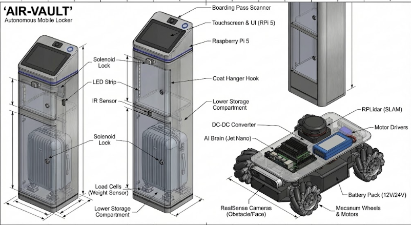


## 의문..

1. 베터리를 꼭 저 아크릴 판 위에 달아야하나 ?
   1. 안정성을 위해 (무거운걸 아래로) 투명 아크릴 판 밑에 달면 안되나?
2. 라이다 센서는 하단에 있어야하나?
   1. 높이가 중요한가?
   2. 위에 달리면 안되나?

# 하드웨어 별 필요 기능 정의 MVP(희정머릿속)

## 캐리포터에게 요구되는 기능

1. 주행(라인트레이싱 + 객체 탐지시 멈추고 기다려! - 비킬때까지)

1. 문개방
   1. [https://www.youtube.com/shorts/Nkiu7Y6h7S4](https://www.youtube.com/shorts/Nkiu7Y6h7S4) → (링키지 도어)
   2. [https://www.youtube.com/shorts/8pUzE5C5FyU](https://www.youtube.com/shorts/8pUzE5C5FyU)
   3. [https://www.youtube.com/shorts/TLROAYXxkvA](https://www.youtube.com/shorts/TLROAYXxkvA)
   - 사물함에 넣는다는 가정 하에, 완벽히 열려서 사물함과 밀착이 가능해야 함
   - 사용자가 물건을 넣을 때 휠체어를 방해하지 않아야 함


1. 잠금

   1. 최대한 간단하지만 lock/unlock은 잘 제어 되어야 함
   2. [https://www.youtube.com/shorts/YbbVHc6bWrg](https://www.youtube.com/shorts/YbbVHc6bWrg)
   3. [https://www.youtube.com/watch?v=2vxGPxSi7Vo](https://www.youtube.com/watch?v=2vxGPxSi7Vo)

   


1. 박스 넣기/빼기 ↔ 사물함
   1. 컨베이어 벨트
   2. 3d 프린트(3D 프린터로 원통형 롤러를 출력)
   3. GT2 타이밍 벨트(미끄러짐 없는 고무 벨트. 길이에 맞춰 자른 뒤 순접하여 링으로 만듭니다.) - 2000
   4. [3d 프린터로 컨베이어 벨트 만드는 영상 참고자료](https://www.youtube.com/watch?v=xAiQUotU3G4)
2. 무게 탐지
   1. 센서
3. 하중 버티기
4. (후순위) 스피커(문이 열립니다 와 같은 효과음) → 간단한 작업으로 생동성 up
5. (후순위) 카메라로 내부 물체 탐지
6. (후순위) 디스플레이 제어

## 박스에게 요구되는 기능

- 여러개 필요하다, 훼손,오염 위험이 높다
- 빈상자는 로봇이 메인 스테이션으로 가지고 와서 들고있는다
  - 고객에게 박스에서 물건을 빼준 후 그대로 들고 main station 복귀
  - 사물함은 빈상태 or 채워진 박스가 있는 상태

1. 물건 담기(하중 버티기)
   1. 무게 센서를 여기달까?
   2. 상자 수만큼 센서 필요 → 비용 up..?
2. (후순위) 디자인 → 기본은 아크릴 투명박스 정도

   1. 크기를 정해야한다 → 캐리포터에 크기에 따라
   2. [구매링크](https://www.coupang.com/vp/products/8142255421?itemId=23139589312&vendorItemId=90172492092&q=%EC%95%84%ED%81%AC%EB%A6%B4+%EB%B0%95%EC%8A%A4+%EC%98%A4%ED%94%88%ED%98%95&searchId=f5ecd8b91274630&sourceType=search&itemsCount=36&searchRank=1&rank=1&traceId=mke2zjyr)

   

## 사물함에게 요구되는 기능

1. 캐리포터가 오면 특정 칸이 열린다.
   1. 잠금해제는 캐리포터와 동일
   2. 캐리가 사물함 근처에 가까워 졌을 때, 캐리포타가 열고자 하는 사물함 도어를 해지하는 신호를 전송?
2. 문이 열린다(완전히)
   1. 로봇이 박스를 넣을 때 방해 x
3. 박스를 빼준다
   1. 컨베이어 벨트
4. 사람이 사물함 문을 열 경우에 열린다.
5. (후순위) 사물함에 디스플레이 설치
   1. 보딩패스로 잠금해제 또는 잠금해제 제어(간단히 열리게)

## 추가적으로 필요한 모터?

- 잠금용, 문 개폐용, 컨베이어 벨트 용(3개로 추정)

## 하드웨어 디자인 아이디어1 - 사물함과 캐리포터 둘다 컨베이어 벨트 달기

- 종이에 그렸는데 카메라 봉인으로 가져가서 보여드리면서 설명하겠습니다.

### 예상 구매 물품

| **순번**                                                                                                          | **부품명**                            | **용도**                                         | **예상 가격** | **검색 키워드 / 링크 팁** |
| ----------------------------------------------------------------------------------------------------------------- | ------------------------------------- | ------------------------------------------------ | ------------- | ------------------------- |
| **1**                                                                                                             | **GT2 타이밍 벨트 & 풀리 세트**       | **[컨베이어 벨트 제작]**                         |
| 고무줄보다 튼튼하고 톱니가 있어 모터 힘을 잘 전달합니다. 3D 프린팅 롤러에 감아 씁니다.                            | 약 5,000원                            | `GT2 타이밍 벨트`, `GT2 풀리` (벨트 폭 6mm 추천) |
| **2**                                                                                                             | **608ZZ 베어링 (4~8개)**              | **[롤러 회전용]**                                |
| 컨베이어 롤러 양 끝에 끼웁니다. 피젯 스피너에 들어가는 그 베어링입니다. 엄청 부드럽게 돌아갑니다.                 | 개당 300원                            |
| (약 2,000원)                                                                                                      | `608zz 베어링`, `스케이트보드 베어링` |
| **3**                                                                                                             | **마이크로 리미트 스위치 (2개)**      | **[센서]**                                       |
| 문이 다 열렸는지, 서랍이 다 나왔는지 감지하여 모터를 멈춥니다. "딸깍" 하는 스위치입니다.                          | 개당 500원                            |
| (약 1,000원)                                                                                                      | `리미트 스위치`, `KW12-3`             |
| **4**                                                                                                             | **L9110S 모터 드라이버 (2개)**        | **[모터 제어]**                                  |
| ⚠️중요: 바퀴 4개로 메인 드라이버가 꽉 찼을 겁니다. 컨베이어 모터를 따로 돌리기 위해 이 작은 모듈이 꼭 필요합니다. | 개당 800원                            |
| (약 1,600원)                                                                                                      | `L9110S`, `아두이노 모터 드라이버`    |
| **5**                                                                                                             | **암-수 / 암-암 점퍼와이어 (세트)**   | **[배선 연장]**                                  |
| 로봇 층간 높이 때문에 선이 짧을 수 있습니다. 20cm 이상 긴 선이 필요합니다.                                        | 약 3,000원                            | `점퍼케이블 20cm`, `40p 듀퐁 케이블`             |
| **6**                                                                                                             | **미니 경첩 (2개)**                   | **[문 고정]**                                    |
| 3D 프린터로 뽑아도 되지만, 금속 경첩이 훨씬 부드럽고 튼튼합니다.                                                  | 약 1,000원                            | `미니 경첩`, `숨은 경첩`                         |

# 하드웨어 스케치

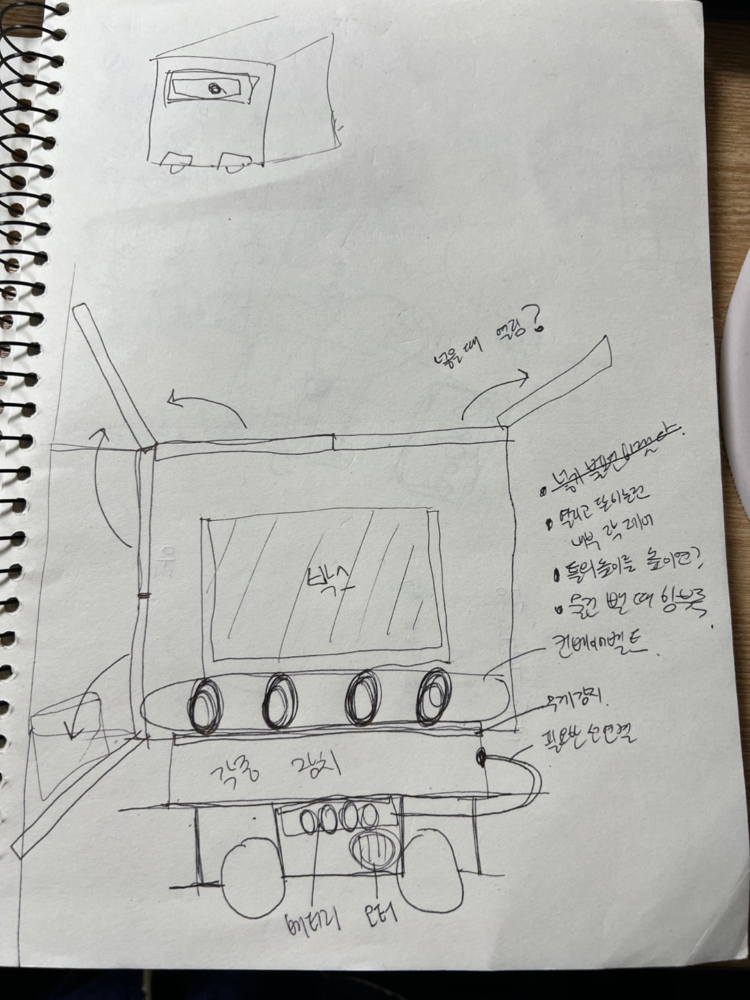
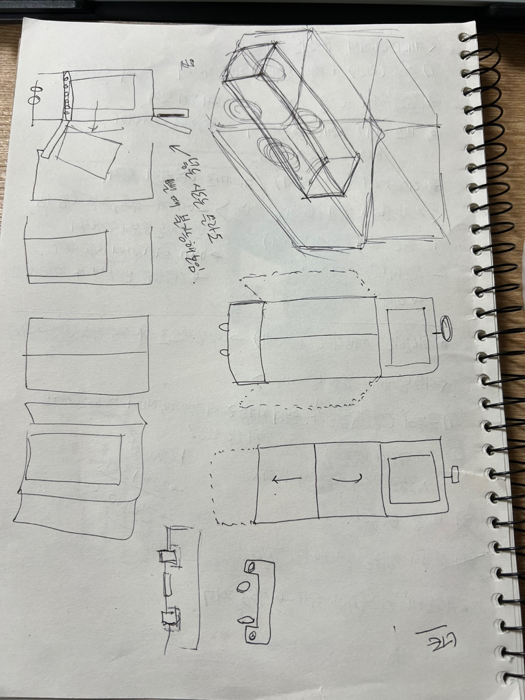
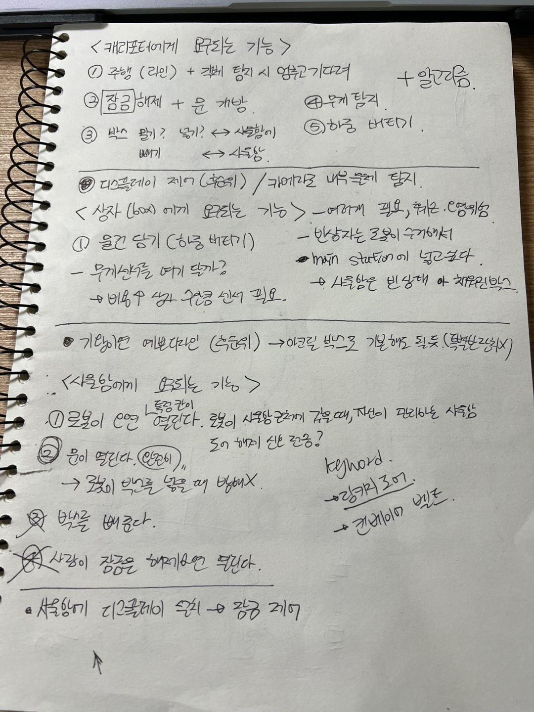
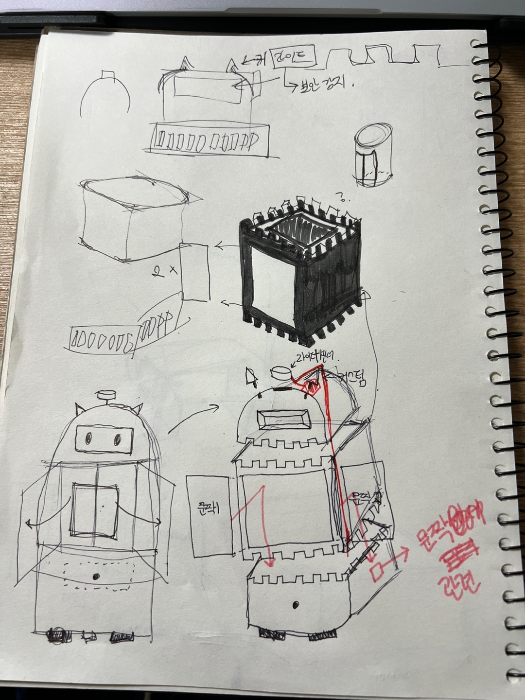
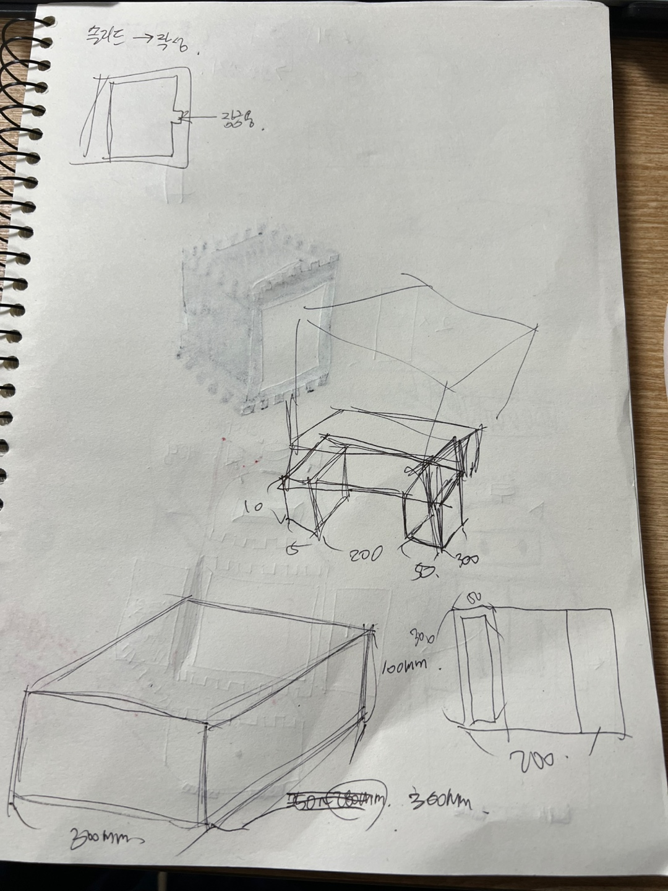

# 로봇 3d 그려보기

- 팅거캐드 사용법 익힌 후 스케치대로 구현 시도
  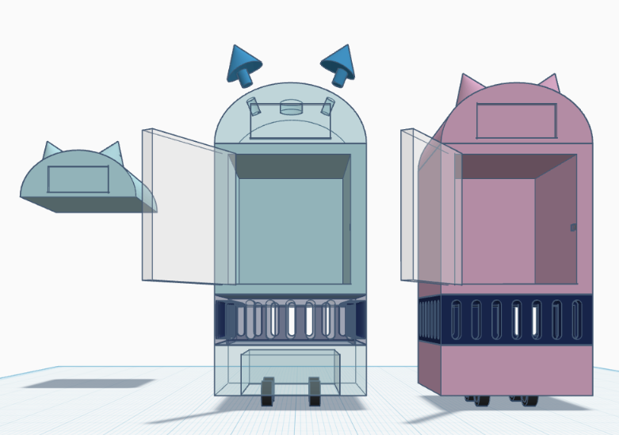
  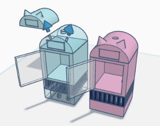
