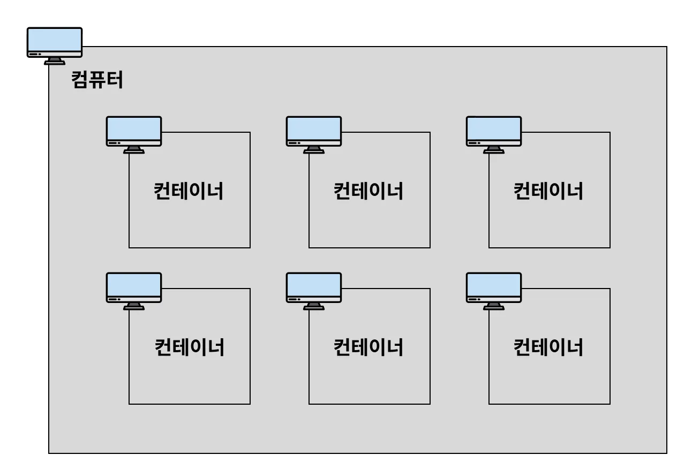

# 1. Docker 기본 개념

# Docker를 왜 사용할까?

## 이식성

-   특정 프로그램을 다른 곳으로 쉽게 옮겨서 설치 및 실행할 수 있는 특성

<aside>
💡

1. 매번 귀찮은 **설치 과정을 일일이 거치지 않아도 된다.**
2. **항상 일관되게** 프로그램을 설치할 수 있다. (버전, 환경 설정, 옵션, 운영 체제 등)
3. 각 프로그램이 독립적인 환경에서 실행되기 때문에 **프로그램 간에 서로 충돌이 일어나지 않는다.**
 </aside>

# IP / Port

## IP

-   네트워크 상에서의 특정 컴퓨터를 가리키는 주소

## Port

-   한 컴퓨터 내에서 실행되고 있는 특정 프로그램의 주소

## 브라우저에서 왜 포트 번호까지 입력하지 않을까?

-   특정 서버와 통신하기 위해서는 IP 주소와 포트 번호를 둘 다 알아야 한다.
-   그러나 도메인 주소를 통해서 알 수 있는 건 IP 주소 뿐이다.
-   그렇다면 포트 번호 없이 어떻게 정상적으로 통신을 할 수 있는 걸까?

<aside>
💡

주소창에 도메인 주소를 입력해서 엔터를 누르면, **브라우저(크롬, 익스플로러 등)는 기본적으로 80번 포트로 통신을 보내게 설정되어 있다.** 그래서 포트 번호를 입력해주지 않아도 통신이 잘 됐던 것이었다. 만약 80번 포트로 통신하고 싶지 않고, 3000번 포트로 통신하고 싶다면 아래와 같이 주소창에 입력해야 한다.

</aside>

## well-known port

-   포트 번호는 0 ~ 65535번 까지 사용할 수 있다.
-   그 중에서 0 ~ 1023번 까지의 포트 번호는 주요 통신을 위한 규약에 따라 이미 정해져 있다.
-   이렇게 규약을 통해 역할이 정해져 있는 포트 번호를 보고 잘 알려진 포트(well-known port)라고 부른다.

<aside>
💡

-   **22번 (SSH, Secure Shell Protocol)** : 원격 접속을 위한 포트 번호
    -   EC2 인스턴스에 연결할 때 22번 포트를 사용한다.
-   **80번 (HTTP)** : HTTP로 통신을 할 때 사용
-   **443번 (HTTPS)** : HTTPS로 통신을 할 때 사용
</aside>

-   위에서 정해 놓은 규약을 꼭 지키지 않아도 된다.
    -   규약으로 정해져 있는 포트 번호와 다르게 사용해도 된다.
    -   특정 서버와 HTTP 통신을 할 때 80번 포트를 쓰지 않고 3000번 포트나 8080번 포트를 써도 상관 없다.

# Docker? / Conatiner? / image?

## Docker

-   컨테이너를 사용하여 각각의 프로그램을 분리된 환경에서 실행 및 관리할 수 있는 틀이다.

## Container

-   윈도우 환경을 사용해보면 하나의 컴퓨터에 여러 사용자로 나눠서 사용할 수 있게끔 구성되어 있다. 각 사용자의 환경에 들어가보면 독립적으로 구성되어 있어서 필요한 프로그램을 각 사용자 환경에 따로따로 설치해주어야 한다.
-   컨테이너도 이와 비슷한 개념이다. 하나의 컴퓨터 환경 내에서 **독립적인 컴퓨터 환경**을 구성해서, 각 환경에 프로그램을 별도로 설치할 수 있게 만든 개념이다. 하나의 컴퓨터 환경 내에서 여러개의 **미니 컴퓨터 환경**을 구성할 수 있는 형태이다. 여기서 얘기하는 **미니 컴퓨터**를 보고 Docker에서는 **컨테이너(Container)**라고 부른다.



-   여기서 ‘**컨테이너**’와 ‘**컨테이너를 포함하고 있는 컴퓨터**’를 구분하기 위해 컨테이너를 포함하고 있는 컴퓨터를 ‘**호스트(host) 컴퓨터**’라고 부른다.

### Container의 독립성

위의 설명에서 컨테이너는 ‘독립적인 컴퓨터 환경’이라고 얘기했다. 구체적으로 어떤 것들이 독립적으로 관리되는 지 기억해두자.

-   **디스크 (저장 공간)**
    -   각 컨테이너마다 서로 각자의 저장 공간을 가지고 있다. 일반적으로 A 컨테이너 내부에서 B 컨테이너 내부에 있는 파일에 접근할 수 없다.
-   **네트워크 (IP, Port)**
    -   각 컨테이너마다 고유의 네트워크를 가지고 있다. 컨테이너는 각자의 IP 주소를 가지고 있다.

## Image

-   닌텐도와 같은 게임기를 보면 여러가지 칩을 꽂아서 다양한 게임을 즐길 수 있게 되어 있다. Docker에서는 **닌텐도의 칩**과 같은 역할을 하는 개념이 **이미지(Image)**이다.
-   Node.js 기반의 Express.js 서버 프로젝트를 이미지로 만들었다고 가정해보자. 이 이미지를 Docker로 실행시키면 Express.js 서버 프로젝트가 컨테이너(Container) 환경에서 실행된다. 복잡한 설치 과정을 거칠 필요 없이 손쉽게 실행된다.
-   또 다른 예로, MySQL 서버를 이미지로 만들었다면, 이 이미지를 Docker로 실행시키는 순간 MySQL 서버가 컨테이너(Container) 환경에서 실행된다. MySQL을 일일이 설치할 필요없이 MySQL 데이터베이스를 사용할 수 있게 된다.
-   **이미지(Image)**는 **프로그램을 실행하는 데 필요한 설치 과정, 설정, 버전 정보 등을 포함**하고 있다. 즉, **프로그램을 실행하는 데 필요한 모든 것을 포함**하고 있다.

# Docker 전체 흐름 (Nginx 설치 및 실행)

```bash
# nginx 이미지 다운로드
$ docker pull nginx

# 다운로드 된 이미지 확인
$ docker image ls

# 이미지를 컨테이너에 올려 nginx 서버 실행시키기
$ docker run --name webserver -d -p 80:80 nginx

# 실행되고 있는 모든 컨테이너 상태 확인하기
$ docker ps

# 특정 컨테이너 정지
$ docker stop webserver
```

-   nginx 서버가 잘 실행되는지 확인하기


-   그림으로 이해하기


