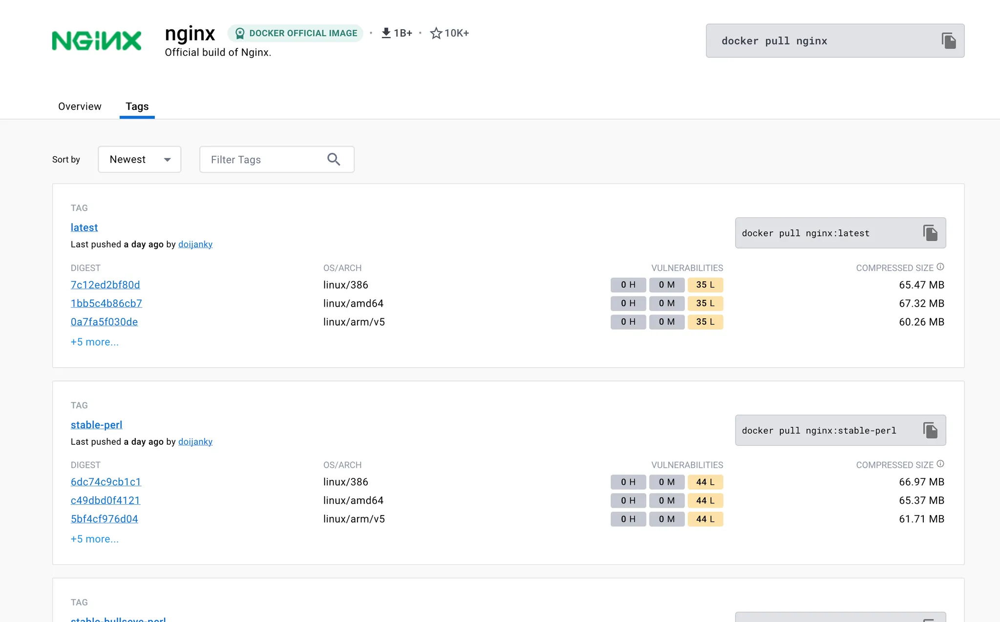

# 2. 현업에서 자주 사용하는 Docker CLI 익히기

# 이미지 다운로드

## 최신 버전(latest)이미지 다운로드

```bash
# docker pull 이미지 명
$ docker pull nginx # docker pull nginx:latest와 동일하게 작동
```

- 이미지를 다운로드 할 때 Dockerhub이라는 곳에서 이미지를 다운 받는다.
- Github은 사람들이 올려놓은 다양한 코드들이 저장되어 있어서 clone, pull을 받아서 사용할 수 있다. Dockerhub도 마찬가지로 사람들이 올려놓은 이미지들이 저장되어 있어서 pull을 통해 다운받아서 사용할 수 있다.
- **Dockerhub**은 Github처럼 **이미지를 저장 및 다운받을 수 있는 저장소 역할**을 하고 있다.

## 특정 버전 이미지 다운로드

```bash
# docker pull 이미지명:태그명
$ docker pull nginx:stable-perl
```

- **특정 버전을 나타내는 이름**을 태그명이라고 한다. 태그명은 dockerhub에서 확인할 수 있다.



[nginx - Official Image | Docker Hub](https://hub.docker.com/_/nginx)

# 이미지(Image) 조회 / 삭제

## 다운받은 모든 이미지 조회

```bash
$ docker image ls
```


- `ls` : list의 약자
- `REPOSITORY` : 이미지 이름(이미지명)
- `TAG` : 이미지 태그명
- `IMAGE ID` : 이미지 ID
- `CREATED` : 이미지가 생성된 날짜 (다운받은 날짜 X)
- `SIZE` : 이미지 크기

## 이미지 삭제

### 특정 이미지 삭제

```bash
$ docker image rm [이미지 ID 또는 이미지 명]
```

- `rm` : remove의 약자
- `이미지 ID`를 입력할 때 전체 ID를 다 입력하지 않고 ID의 일부만 입력해도 된다.
(단, ID의 일부만 입력했을 때, 입력한 ID의 일부를 가진 이미지가 단 1개여야 한다.)
- 컨테이너에서 사용하고 있지 않은 이미지만 삭제가 가능하다.

### 중지된 컨테이너에서 사용하고 있는 이미지 강제 삭제하기

```bash
$ docker image rm -f [이미지 ID 또는 이미지 명]
```

- 실행 중인 컨테이너에서 사용하고 있는 이미지는 강제로 삭제할 수 없다.

### 전체 이미지 삭제

```bash
# 컨테이너에서 사용하고 있지 않은 이미지만 전체 삭제
$ docker image rm $(docker iamges -q)

# 컨테이너에서 사용하고 있는 이미지를 포함해서 전체 이미지 삭제
$ docker image rm -f $(docker images -q)
```

- `docker images -q` : 시스템에 있는 모든 이미지의 ID를 반환한다. 여기서 `-q` 옵션은 quite를 의미하며, 상세 정보 대신에 각 이미지의 고유한 ID만 표시하도록 지시한다.

# 컨테이너(Container) 생성 / 실행 - 1

## 컨테이너 생성

> 이미지를 바탕으로 컨테이너를 **생성**한다. 이 때, 컨테이너를 **실행시키지는 않는다.**
> 
> 
> (컨테이너를 실행하지 않고 생성만 하는 경우가 잘 없어서, 이 명령어는 잘 사용하지 않는다.)
> 

```bash
# docker create 이미지명[:태그명]
$ docker create nginx

$ docker ps -a # 모든 컨테이너 조회
```

- 로컬 환경에 다운받은 이미지가 없다면 Dockerhub으로부터 이미지를 다운(`docker pull`)받아서 컨테이너를 생성한다.

## 컨테이너 실행

> 정지되어 있는 컨테이너를 실행시킨다.
> 

```bash
# docker start 컨테이너명[또는 컨테이너 ID]
$ docker start 컨테이너명[또는 컨테이너 ID]

$ docker ps # 실행 중인 컨테이너 조회

# nginx 컨테이너 중단 후 삭제하기
$ docker ps # 실행 중인 컨테이너 조회
$ docker stop {nginx를 실행시킨 Container ID} # 컨테이너 중단
$ docker rm {nginx를 실행시킨 Container ID} # 컨테이너 삭제
$ docker image rm nginx # nginx 이미지 삭제
```

# 컨테이너(Container) 생성 / 실행 - 2

## 컨테이너 생성 + 실행

> 이미지를 바탕으로 컨테이너를 생성한 뒤, 컨테이너를 실행까지 시킨다.
(처음에 이미지를 바탕으로 컨테이너를 실행시키고 싶을 때, 이 명령어를 자주 사용한다.)
> 

```bash
# docker run 이미지명[:태그명]
$ docker run nginx # 포그라운드에서 실행 (추가적인 명령어 조작을 할 수가 없음)

# Ctrl + C 로 종료할 수 있음
```

- 로컬 환경에 다운받은 이미지가 없다면 Dockerhub으로부터 이미지를 다운(`docker pull`)받아서 실행시킨다.
- Dockerhub으로부터 **새롭게 갱신된 이미지를 다운** 받고 싶다면 `docker pull` 명령어를 활용해야 한다.

### 컨테이너를 백그라운드에서 실행시키기

```bash
# docker run -d 이미지명[:태그명]
$ docker run -d nginx

# nginx 컨테이너 중단 후 삭제하기
$ docker ps # 실행 중인 컨테이너 조회
$ docker stop {nginx를 실행시킨 Container ID} # 컨테이너 중단
$ docker rm {nginx를 실행시킨 Container ID} # 컨테이너 삭제
$ docker image rm nginx # nginx 이미지 삭제
```

### 컨테이너에 이름 붙여서 생성 및 실행하기

```bash
# docker run -d --name [컨테이너 이름] 이미지명[:태그명]
$ docker run -d --name [컨테이너 이름] 이미지명[:태그명]

# nginx 컨테이너 중단 후 삭제하기
$ docker ps # 실행 중인 컨테이너 조회
$ docker stop {nginx를 실행시킨 Container ID} # 컨테이너 중단
$ docker rm {nginx를 실행시킨 Container ID} # 컨테이너 삭제
$ docker image rm nginx # nginx 이미지 삭제
```

### 호스트의 포트와 컨테이너의 포트를 연결하기

```bash
# docker run -d -p [호스트 포트]:[컨테이너 포트] 이미지명[:태그명]
$ docker run -d -p 4000:80 nginx
```


- `docker run -p 4000:80` 라고 명령어를 입력하게 되면, 도커를 실행하는 호스트의 4000번 포트를 컨테이너의 80번 포트로 연결하도록 설정한다.

# 컨테이너(Container) 조회 / 중지 / 삭제

## 컨테이너 조회

### 실행 중인 컨테이너들만 조회

```bash
$ docker ps
```

- `ps` : process status의 약자

### 모든 컨테이너 조회 (작동 중인 컨테이너 + 작동을 멈춘 컨테이너)

```bash
$ docker ps -a
```

- `-a` : all의 약자

## 컨테이너 중지

```bash
$ docker stop 컨테이너명[또는 컨테이너 ID]
$ docker kill 컨테이너명[또는 컨테이너 ID]
```

- 집에 있는 컴퓨터로 비유하자면 `stop`은 시스템 종료 버튼을 통해 정상적으로 컴퓨터를 종료하는 걸 의미하고, `kill`은 본체 버튼을 눌러 무식

## 컨테이너 삭제

### 중지되어 있는 특정 컨테이너 삭제

```bash
$ docker rm 컨테이너명[또는 컨테이너 ID]
```

- 실행 중인 컨테이너는 중지한 후에만 삭제가 가능하다.

### 실행되고 있는 특정 컨테이너 삭제

```bash
$ docker rm -f 컨테이너명[또는 컨테이너 ID]
```

### 중지되어 있는 모든 컨테이너 삭제

```bash
$ docker rm $(docker ps -qa)
```

### 실행되고 있는 모든 컨테이너 삭제

```bash
$ docker rm -f $(docker ps -qa)
```

# 컨테이너(Container) 로그 조회

## 컨테이너(Container) 로그 조회

### 특정 컨테이너의 모든 로그 조회

```bash
# docker logs [컨테이너 ID 또는 컨테이너명]

$ docker run -d nginx
$ docker logs [nginx가 실행되고 있는 컨테이너 ID]
```

### 최근 로그 10줄만 조회

```bash
# docker logs --tail [로그 끝까지 표시할 줄 수] [컨테이너 ID 또는 컨테이너명]
$ docker logs --tail 10 [컨테이너 ID 또는 컨테이너명]
```

### 기존 로그 조회 + 생성되는 로그를 실시간으로 보고 싶은 경우

```bash
# docker logs -f [컨테이너 ID 또는 컨테이너명]

# nginx의 컨테이너에 실시간으로 쌓이는 로그 확인하기
$ docker run -d -p 80:80 nginx
$ docker logs -f
```

- `-f` : follow의 약어

### 기존 로그는 조회하지 않기 + 생성되는 로그를 실시간으로 보고 싶은 경우

```bash
$ docker logs --tail 0 -f [컨테이너 ID 또는 컨테이너명]
```

# 실행 중인 컨테이너 내부에 접속하기 (exec -it)

## 실행 중인 컨테이너 내부에 접속하기

```bash
# docker exec -it 컨테이너명[또는 컨테이너 ID] bash

$ docker run -d nginx
$ docker exec -it [nginx가 실행되고 있는 컨테이너 ID] bash
$ ls # 컨테이너 내부 파일 조회
$ cd /etc/nginx
$ cat nginx.conf
```

- 컨테이너 내부에서 나오려면 `Ctrl + D` 또는 `exit` 을 입력하면 된다.
- `bash` : 쉘(Shell)의 일종
- `-it`
    - `-it` 옵션을 사용해야 명령어를 입력하고 결과를 확인할 수 있다.
    - `-it` 옵션을 적지 않으면 명령어를 1번만 실행시키고 종료되어 버린다.
    - 즉, `-it` 옵션을 적어야 계속해서 명령어를 입력할 수 있다.


# Docker로 Redis 실행시켜보기

[redis - Official Image | Docker Hub](https://hub.docker.com/_/redis)

```bash
# 1. Redis 이미지를 바탕으로 컨테이너 실행시키기
$ docker run -d -p 6379:6379 redis

# 2. 다운로드 된 이미지 확인하기
$ docker image ls

# 3. 컨테이너가 잘 실행되고 있는 지 체크
$ docker ps

# 4. 컨테이너 실행시킬 때 에러 없이 잘 실행됐는지 로그 체크
$ docker logs [컨테이너 ID 또는 컨테이너명]

# 5. Redis 컨테이너에 접속
$ docker exec -it [컨테이너 ID 또는 컨테이너명] bash

# 6. 컨테이너에서 redis 사용해보기
$ redis-cli

127.0.0.1:6379> set 1 jscode
127.0.0.1:6379> get 1
```


## 그림으로 이해하기

