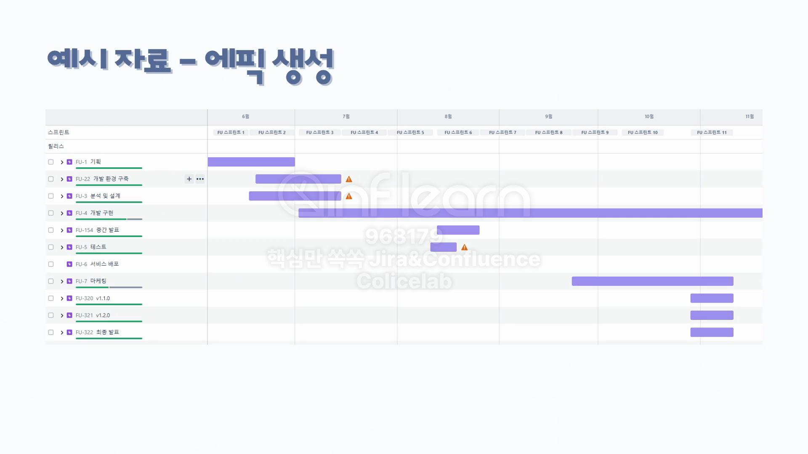

# 1. Jira로 이슈 생성하기

# ✅이슈

## 이슈 유형

- **에픽, 작업, 스토리, 버그**
- `에픽` : 진행해야 하는 업무에 대한 큰 묶음
- `작업` : 개발 팀이 수행해야 하는 작업
- `스토리` : 사용자의 세부요구사항을 이야기 형태로 기술한 것
- `버그` : 결함 수정 항목

> *에픽 생성 후에 작업, 스토리, 버그를 생성한다.*
> 

# ✅타임라인

## 종속성 발생 시

- 프로젝트를 진행하면서 특정 업무가 다른 업무에 의존하고 있을 때 링크를 사용한다.

## 종속성 해제 방법

# ✅예시

