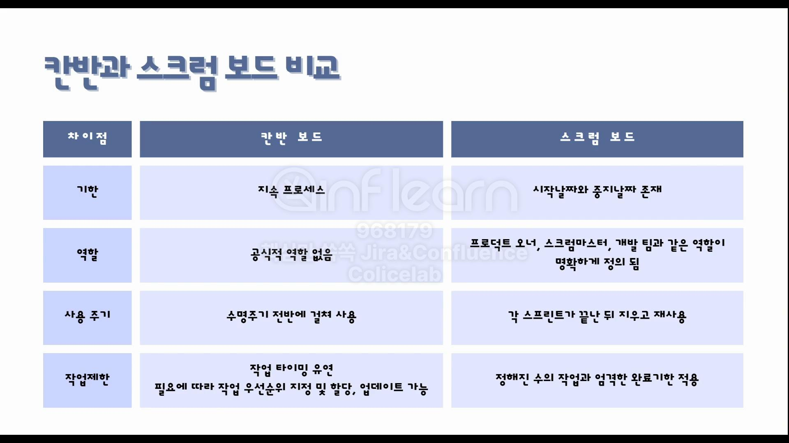

# Backlog, Kanban, Workflow 개념

# 백로그

- 완료되지 않은 작업 항목들의 목록
- 이 목록에는 아직 처리되지 않은 업무, 작업, 요구사항들이 포함된다.

## 프로덕트 백로그

- 제품 개발에 필요한 모든 작업 목록을 담고 있는 리스트
- 우선사항이 있는 요구사항의 목록
- 이해관계자의 요구사항은 제품 서비스 기능과 같이 다양한 항목들로 구성되는데 프로덕트 백로그에서는 이해관계자가 추구하는 기능적 비기능적 가치와 연결이 되어 있다.

# 칸반

- 칸반보드를 사용하여 작업과 작업 흐름을 시각화해 작업 중에 원활한 흐름 유도를 하고 작업의 효율성을 극대화 목표로 하는 애자일 업무 관리 방법

## 칸반 특징

- 가상 신호카드를 구현한 칸반보드를 사용해서 작업을 시각화한다.
- 풀 시스템을 사용하여 작업자가 처리할 수 있는 능력이 있을 때 작업을 가져온다.
- 진행 중 업무 WIP(Work In Progress) 를 제안하여 지속 가능한 업무 흐름을 구현한다.
- 칸반 방법은 단독 사용보다는 다른 방법론이나 프레임워크에 융합된 형태로 주로 사용한다.

## 칸반 제작 원칙

1. 작업수행은 반드시 왼쪽에서 오른쪽으로 작업자가 당겨서 수행한다.
2. 하나 이상의 약속지점(commitment point)과 제공 지점(delivery point)이 있다.
3. 진행 중 업무 (Work In Progress)를 제한한다.
4. WIP 제한은 프로젝트 팀이 작업 집중도를 지속적으로 유지하면서 작업을 수행할 수 있도록 돕는다.

## 칸반과 스크럼 보드 비교

# WIP 제한

- Jira의 보드에서 열의 더보기 누르면 열 제한 설정이 나온다.
    - 우리가 스프린트를 진행할 때 이슈의 개수를 제한함으로써 업무가 과중되는 것을 막아줄 수 있다.
    - 예시는 최대 이슈를 3개로 지정했을 때의 경우
        - 이슈가 해당 열에 3개로 지정되었다면 그 이하의 이슈 개수가 할당되었을 때 특정 표시가 되지 않지만 이슈 개수가 초과했을 때는 붉게 표시가 되어 이슈가 과도하게 잡혀 있지 않도록 관리할 수 있다.

# 워크플로

- Workflow는 작업 절차를 통한 정보 또는 업무의 이동을 의미하면서 작업 흐름이라고 말한다.
- 업무를 지원하기 위해 정보가 어떻게 흐르는지, 업무가 어떻게 추적되는지 알 수 있는 작업의 흐름

- 워크플로우의 요소로는 상태, 전환, 해결이 있다.

## Jira 워크플로 요소

- `상태` : 워크플로 내 이슈 위치 (ex: 진행 중, 검토 중, 예약됨 등)
- `전환` : 이슈를 다음 상태로 이동하기 위해 취하는 조치. 단방향 링크이기 때문에 이슈가 상태를 여러번 전환해야 하는 경우 전환을 추가해야 함
    - 진행 중에서 검토 중으로 왔을 때 다시 진행 중으로 가야 할 경우 전환을 추가해주는 식으로 사용해야 한다.
- `해결` : 작업 완료

## Jira에서 워크플로를 확인하는 방법

### **[백로그]**

### **[스프린트 완료 버튼 옆에 더보기]**

# Jira 백로그 기능

## [스프린트가 아직 활성화 되지 않은 상태의 백로그 기능]

- 스프린트 계획하기
    - 이 스프린트의 작업을 계획하려면 백로그 세션에서 이슈를 끌어다 놓거나 새 이슈를 생성한다.

# Jira 보드 기능

