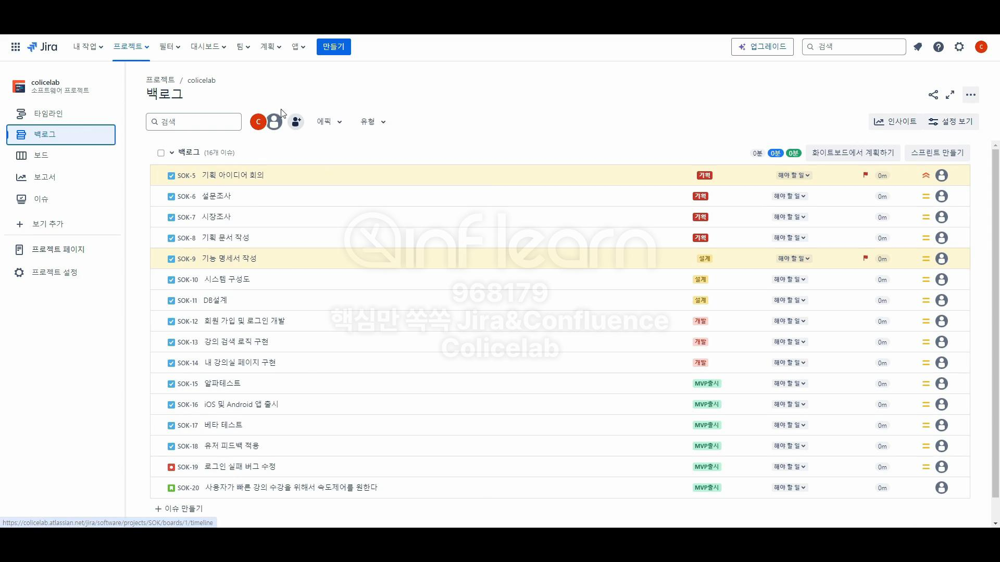

# Jira에서 스프린트 만들고 보드와 연동하기

# 스프린트 만드는 과정

## 백로그

- **백로그란?**
    - 완료되지 않은 작업들의 항목

### 스프린트 만들기 클릭

- 스프린트 이름은 팀 내에서 정한 이름으로 결정하면 된다.
- 스프린트와 백로그 사이에 `구분선` 같은 친구가 보입니다.
    - 이 친구를 드래그해서 스프린트 안에 넣어버릴 수 있습니다 .

### 스프린트 시작 클릭

## 보드

### +버튼으로 검토 열 만들기(선택)

- 업무를 진행할 때에는 업무가 진행되는 상황에, 시간에 맞춰서 이슈를 움직인다.

### 미해결된 이슈를 어디로 이동할까?

- 새 스프린트와 백로그 둘 중 하나로 옮길 수 있는데 일단 `새 스프린트`로 옮긴다.
    - 추후, 백로그로 옮기는 것도 할 거임.. 암튼 그럼

### 스프린트 완료 클릭 시

- 우리팀에서 사용하고 있는 스페이스 설정
- 화이트보드 회고 / 페이지 회고 중 선택
- 페이지 회고 먼저 진행해볼 것임.