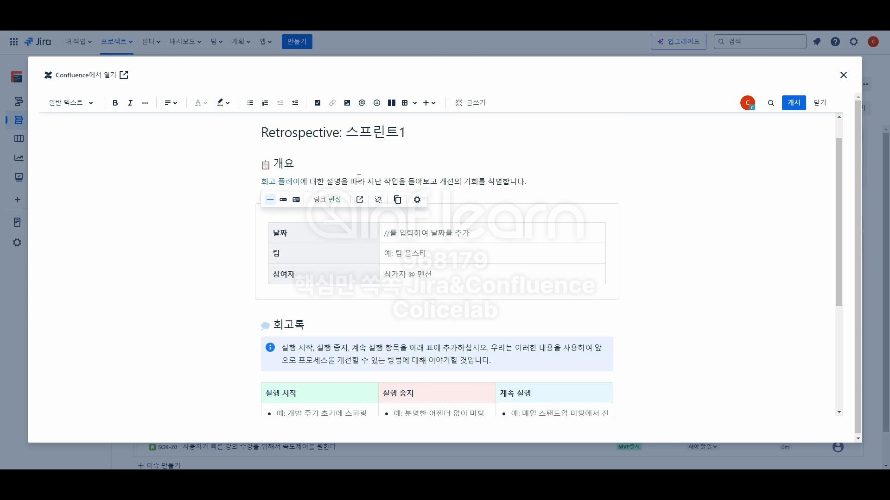

# Confluence 에서 페이지 회고하기

# 페이지 회고

## 회고록 - 팝업

- 스프린트 완료 후 화이트 보드 / 페이지 둘 중 페이지를 고르고 `만들기` 를 누르게 되면 위에 팝업 창이 나온다.(Jira Confluence 창)

### 회고록 - 개요

- 사진 상에서는 셀 서식처럼 배경을 바꿀 수 있습니다.
- 그러나, 현재 Jira UI의 경우 저런 건 보이지 않습니다.

**[해결 방법]**

- 셀 클릭하고 화살표 클릭. or 셀 클릭하고 `Shift + F10`

### 회고록 - 작업항목

- 스프린트에서 해결한 이슈가 있었고, 미해결한 이슈도 있었다!
    - 이런 것들을 후속 조치를 어떻게 할 것인지 적어주는 곳이 바로 여기입니다.
    - 작업 입력, 멘션을 통해서 다른 팀원들이나 이런 부분들 전달하거나 할당

- 페이지와 다르게 최신 UI에서는 `Jira 이슈`라는 것은 없습니다.
    - `Jira 이슈` ↔ `Jira 업무 항목` 으로 변경되었습니다.

- 프로젝트를 선택을 하면 여러분들이 생성을 했었던 이슈들이 전부 나와있다.
- 스프린트를 회고할 때 필요한 내용을 좀 추출해서 가지고 오실 필요가 있다.
- `Key` (SOK-1) 등등 을 누르면 Jira 링크로 넘어간다.
    - 세부 사항 확인 가능

**[스프린트에서 완료된 사항]**

- 필터링 한 결과를 이용하여 회고에 작성한다.
    - 스프린트에서 완료된 사항 → 완료
    - 후속 스프린트에서 진행되어야 하는 상황 → 검토

- `게시` 버튼을 누르면 `회고를 저장했습니다.` 라는 창이 나온다고 주장을 합니다.
    - 최신 UI에는 `게시` 버튼 글자가 안보입니다. → ?
        - 그냥 팝업 바깥 클릭하면 `회고를 저장했습니다.` 창이 나옵니다. → ?

# 스프린트 번다운 차트

