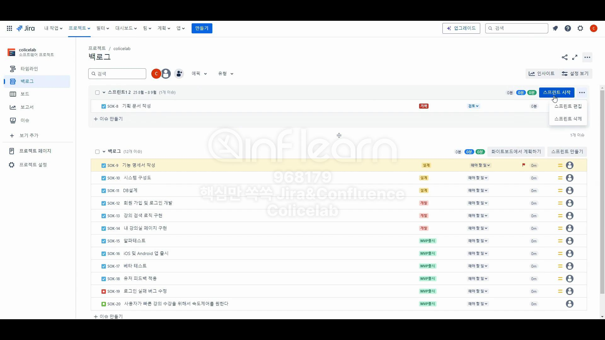

# Jira에서 스프린트 진행 후 Confluence에서 화이트보드 회고하기

# 백로그

## 스프린트1 2에 SOK-8 : 기획 문서 작성은 왜 남아있나

> 스프린트 1 끝나고 나서 완료되지 못한 이슈는 다음 스프린트에 들어가 있도록 지정했기 때문입니다.
> 

## 스프린트 2 시작

## 스프린트 2 종료

### 스프린트 2 에서 완료되지 못한 이슈는 백로그로 보내보기

## 백로그 - 회고설정

# Confluence 화이트보드 회고

## 화이트보드

### 템플릿 위치

- 밑에 툴바에서 제일 오른쪽 누르면 됩니다.
    
    ### 범선 회고
    

### 화이트보드 - 타이머

- 팀원들끼리 시간을 정해 놓고 회고를 한다면 타이머로 시간 지정

### 화이트보드 - 댓글

- 코멘트를 활용하여 원활하게 소통 가능

### 화이트보드 - 툴바

- +버튼에 Jira 업무 항목 만들기를 사용하려면 텍스트가 있는 스티키 메모가 있어야 사용할 수 있다.

- Confluence에서 만들었지만 Jira와 연동이 되기 때문에 `백로그`에서 확인할 수 있다.

## Jira에서 생성되는 이슈 세부창

### 에픽 선택

- 에픽 선택 가능하다.

## Jira에서 생성되는 이슈 세부창

### 활동

- `기록`은 어떤 작업들을 했는지 다 남아있기 때문에 팀원들과 진행할 때 조심히 사용해야 한다.
- `작업 로그`는 이 이슈에 대해 로그된 작업이 아직 없습니다. → 최초 추정치 부터 소요된 시간 추적된 부분들이 나중에 나온다.

## Jira에서 업무 가져오는 기능

### 선으로 뻗어나가는 방법

## 회고 저장

