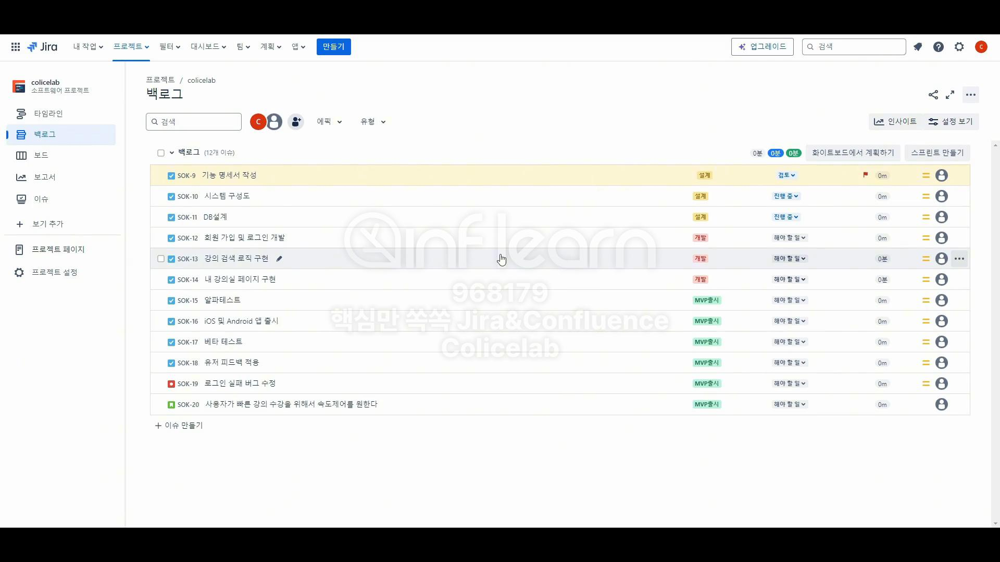

# Jira에서 스프린트 여러 건 생성

# 백로그

## 스프린트가 없다?

- 스프린트가 완료됐을 때 미해결 이슈는 백로그로 넘긴다고 했기 때문!

# 스프린트 생성

- 이슈를 지난 스프린트에서 마무리하지 못한게 있다면?
    - 업무를 제대로 파악해서 넣지 못했다는 말이다!
    - 업무를 쪼개고 쪼개서 한 스프린트 내에 완료할 수 있도록 만드는 것이 중요하다

# 추후에 진행할 스프린트들을 한번에 만들어 놓기

