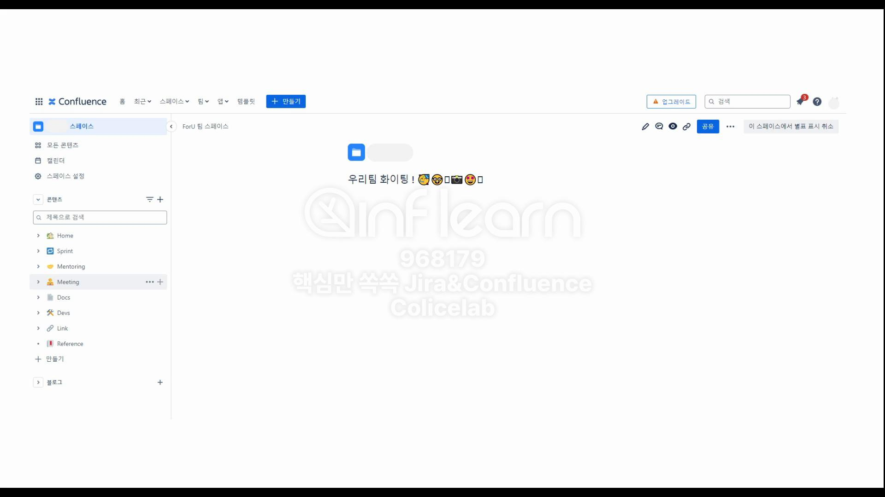

# 실제 프로젝트에서 진행되었던 Confluence 관련 자료

# Confluence 활용 예시

## 문서만 이모지를 사용하지 않고 카테고리도 이모지를 사용한다.

## 모든 문서를 링크화해서 정리한다.

## 회고록 예시

# 정리

- Jira 백로그에서 스프린트를 만든 후 보드에서 작업을 진행하여 Confluence 회고까지 하였다.
- 워크플로 등은 우리 팀의 프로젝트에 알맞은 내용으로 커스터마이징한다.

<aside>
💡

**백로그**

- 완료되지 않은 작업 항목들의 리스트나 목록

**보드**

- 작업과 작업 흐름을 시각화
- 작업 중 원활한 흐름 유도 및 작업 효율성 극대화하는 기능

**회고**

- Confluence의 스페이스에서 화이트보드 회고나 페이지 회고를 통해 스프린트 내용 문서화
</aside>