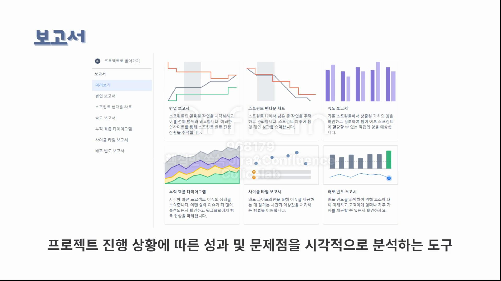

# Jira 보고서 기능

# 보고서

- 프로젝트 진행 상황에 따른 성과와 문제점을 시각적으로 분석하는데 도움을 주는 기능
- 번업 보고서, 스프린트 번다운 차트, 속도 보고서, 누적 흐름 다이어그램, 사이클 타임 보고서, 배포 빈도 보고서

## 사이클 타임 보고서 / 배포 빈도 보고서

- 소스 코드 관리 및 CI/CD 도구와 연결이 필요하다.

## 번업 보고서 / 스프린트 번다운 차트 / 속도 보고서 / 누적 흐름 다이어그램

### 번업 보고서

- 팀이 스프린트를 완료했을 때 진행 상황을 추적
- 완료된 작업량을 보여주고 계획된 작업과 비교
- 범위 확장이나 계획된 프로젝트 경로에서 편차와 같은 문제를 식별하는데 도움을 준다.
- 추정 필드
    - `스토리 포인트`
    - `이슈 수` (보통 이슈 수를 기준으로 본다.)
    - `시간`
- 그래프
    - `초록색 선` : 완료된 작업
    - `붉은색 선` : 작업 범위
    - `회색 선` : 가이드라인
    
    > **선과 선 사이의 거리가 남은 작업량**
    > 
    
    > *작업 범위 선을 확인해서 범위 초과를 확인할 수 있다.*
    > 

### 스프린트 번다운 차트

- 스프린트에서 완료된 작업량과 남은 총 작업을 보여줌
- 팀이 스프린트 기간 내에 작업을 완료할 가능성을 예측하는데 사용되는 보고서
- 그래프
    - 회색 선 : 이상적인 Burn Rate
    - 붉은색 선 : 스프린트 내에 팀이 실제로 작업 완료한 내용
    
    > **작업량이 지침에 가깝게 감소한다 ⇒ 스프린트에서 잘 진행되고 있다.**
    > 

### 속도 보고서

- 기존 스프린트에서 창출한 가치의 양을 확인하고 검토해서 팀이 이후 스프린트에 할당할 수 있는 작업량을 막대 차트 형식으로 나타낸다.
- 그래프
    - `회색` : 스프린트가 시작되었을 때 작업량
    - `초록색` : 스프린트 중 완료된 작업량
- 실제 완료된 스토리 포인트가 약속된 스토리 포인트와 일치하거나 더 많을 경우
    
    ⇒ 팀이 자신들의 예측과 계획을 잘 지키고 있음을 의미
    
- 계획과 실행이 거의 비슷하게 가는게 이상적
    
    ⇒ 위의 보고서는 완료된 양이 더 많다.
    

### 누적 흐름 다이어그램

- 시간 경과에 따른 프로젝트의 이슈 상태를 보여주는 기능
- 보드에서 어떤 열에 이슈가 더 많이 축적되는지 확인한 후에 워크플로우에서 병목 현상을 식별하는데 도움을 주는 보고서
- 그래프
    - `수평축` :  시간
    - `수직축` : 이슈 개수
    - `차트의 각 색상 영역` : 보드에서의 열
- 시간의 지남에 따라서 수직으로 넓어지는 영역이 있는 경우 병목 현상을 겪고 있는 것.
    
    ⇒ 다이어그램이 고르게 상승하며 완료된 이슈가 계속 높아지는 것이 이상적