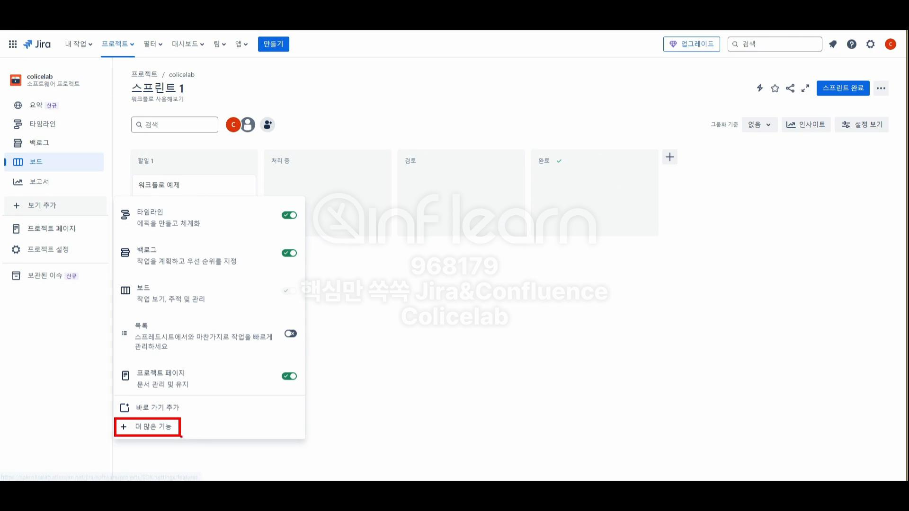

# 실제 프로젝트에서 진행되었던 Jira 개발 섹션 예시자료

# Jira 개발

- 이거 아무나 설치 못한다.
    - 관리자 기능을 하고 있는 사람이 어플리케이션 설치하여서 연동까지 진행하면 좋다.

# 예시

## 브랜치

## 커밋

## PR

## 빌드

- 소스코드를 컴파일하고 테스트를 실행하면서 배포가 가능한 상태로 패키징하는 과정
    - CI/CD 도구, Jenkins, GitHub Action, GitLab CI 등

