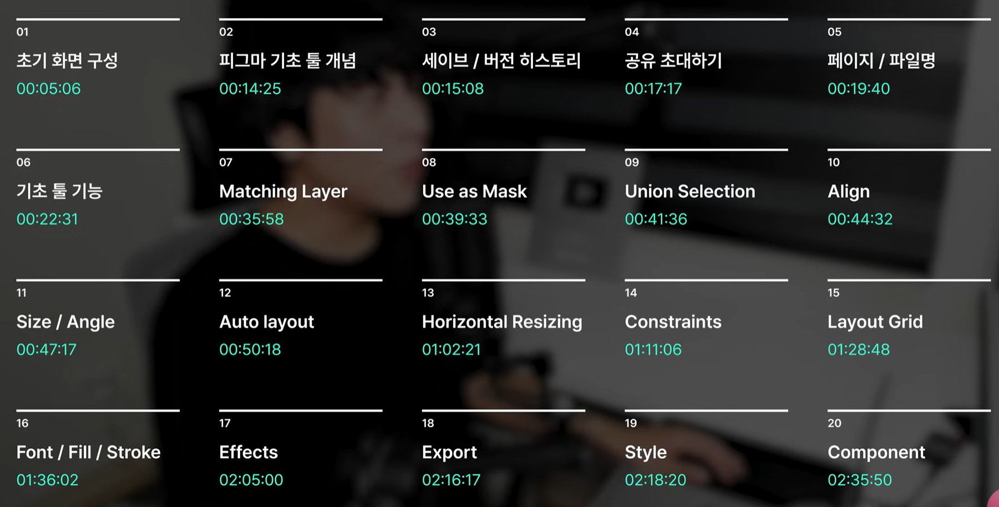

# Figma

[https://youtu.be/c6yCZecrMpQ?si=3-1Ctoe5LisSvxWL](https://youtu.be/c6yCZecrMpQ?si=3-1Ctoe5LisSvxWL)

위 링크의 강의 요약

mac 북 사용 시

[4:22](https://www.youtube.com/watch?v=c6yCZecrMpQ&t=262s&pp=0gcJCTAAlc8ueATH) 타임라인 정리



- [5:06](https://www.youtube.com/watch?v=c6yCZecrMpQ&t=306s)  초기 화면 구성
    
    팀 > 프로젝트 > 파일  순서로 구성 
    
    - 팀 만들기
        
        아래의 + 새로 만들기 클릭
        
        
        
    - 프로젝트 만들기
        
        오른쪽     + 프로젝트 클릭
        
        
        
    
    - 무료 버전은 팀 하나 당 1개의 프로젝트 , 3개의 디자인 파일까지만 사용 가능
    
    파일은 여러가지가 있음
    
    
    
    - 커뮤니티 활용 법, 무료 버전은 좀 구리지만 ‘icon ,  UI/UX 등 검색 후 원하는 툴 사용 가능’
        
        
        
        
        
        ```jsx
        UI/UX 같은 키워드 검색 후  사용하고 싶은 템플릿 열어서 사용
        ```
        
    - 피그잼(FigJam)이란 ?
        
        간단한 메모, 파워포인트 발표 자료 제작에 사용
        
        
        
        
        
    - Import 해오기
        
        
        
        - 2가지 방법
        1. 초안 메뉴에서 우측 모서리 Import 기능 사용하기
        2. 직접 파일 열어서 위의 창에 드래그해서 사용 가능
        
    
- [14:25](https://www.youtube.com/watch?v=c6yCZecrMpQ&t=865s) 피그마 기초 툴 개념
    1. 프레임, 도형, 펜, 폰트 등 기본적으로 디자인 하기 위해 필요한 툴 모음
    
    
    
    1. 레이어 창
    
    
    
    왼쪽에 레이어 창 존재 → 포토샵, 어도비에서 사용하는 레이어와 같음
    
    모른다면 하다보면 뭔지 알게됨
    
    1. 이펙트 창
    
    
    
    컬러, 그림자 등 
    
- [15:08](https://www.youtube.com/watch?v=c6yCZecrMpQ&t=908s) 세이브 / 버전 히스토리
    
    
    
    1. 로컬 복사본 저장 
        
        우리가 흔히 아는    **다른 이름으로 저장** 
        
    2. 버전 내역에 저장
        
        같은 디자인 파일로 여러가지 버전으로 저장 가능
        
        
        
        
        
        수시로 피그마 사용하다가 버전으로 저장해주면 좋음
        
        또한 피그마에서 자동으로 시간마다 버전으로 저장해주는 기능이 있다고 함
        
        그래서 날려먹거나 저장을 못해도 버전이 남아있을 수 있음
        
    
- [17:17](https://www.youtube.com/watch?v=c6yCZecrMpQ&t=1037s&pp=0gcJCTAAlc8ueATH) 공유 초대하기
    1. 공유하기 클릭
    
    
    
    
    
    1. 공유 받을 사람 이메일 
    2. 권한 주기 ( 편집 가능 or 보기만 ) 
    3. 링크 복사를 통해 링크로도 전달 가능
    
- [19:40](https://www.youtube.com/watch?v=c6yCZecrMpQ&t=1180s&pp=0gcJCTAAlc8ueATH) 페이지 / 파일명
    
    
    1. 디자인 파일 안에서도 페이지를 나눌 수 있다.
    
    
    
    
    
    1. 현재   1. 모바일 디자인, 2. 웹 디자인 3. COVER     3개의 페이지가 존재함
    3개 이후 부터는 유료 버전
    
    
    
    1. COVER의 경우 현재 디자인 파일의 썸네일로 설정(우클릭)    → 1번 캡쳐에서 확인 가능 
- [21:31](https://www.youtube.com/watch?v=c6yCZecrMpQ&t=1291s) 기초 툴 기능
    - 디자인 파일 이름 수정
        
        
        
    - 페이지 이름 수정
        
        
        
    - 페이지 전체 배경 색 변경
        
        
        
    
    
    
    각종 툴 기능
    
    - 손 도구
        
        
        
        Space를 누르면 손 도구 모양으로 바꿔 사용 가능하다
        
    - 프레임
        - 프레임 생성
            
            
            
            
            
            수작업으로 W, H 크기를 주어도 괜찮지만 
            
            
            
            사용하고자 하는 프레임을 선택해서 하면 된다.
            
            - 프레임 이름 변경 ( 1. 레이어 창에서,  2.  프레임 왼쪽 위 이름 에서, )
            
            
            
        
    - 도형
        
        
        
        - 사각형
        
        
        
        1. **shift를 누르고 그리면 같은 비율로 크기로 설정**
        2. 도형을 클릭하면 모서리에 o 모양들이 생기는 데 이 모양을 누른 후 당기면 둥글게 만들 수 있음
        
        
        
        ---
        
        
        
        오른쪽 이펙트 창에서 모서리 반경으로도 
        
        수정 가능
        
        ---
        
        - 선
        
        
        
        1. 위치 ,  
        2. 시작(종료) 지점 모양 선택하기,  
        3. 굵기 지정하기
        
        - 화살표
        
        선과 같음
        
        선에서  시작, 종료 지점 모양을 화살표로 바꾼 후 굵기를 바꿔도 같은 모양이 나온다
        
        - 원
        
        pass
        
        - 삼각형
        
        
        
        삼각형을 만들면 와이어 프레임이 삼각형 보다 조금 넓게 잡히는데 
        
        정사각형 그리드를 기점으로 해서 삼각형을 시각적 그리드로 나타낸다 하는데
        무슨 소린지 모르겠음@#  
        
        
        
        
        
        - 별
        
        
        
        개수와 비율에 따른 모양 변경
        
    - 이미지 폴더 가져오기
        
        첫 번째 방법 ( 보통 두 번째 방법을 사용한다 )
        
        - 디자인 툴에서 가져오기
        
        
        
        두 번째 방법 
        
        - 틀에 찍어내기기
        
        
        
        이미지를 삽입할 모양을 하나 만든다
        
        
        
        1. 채우기의 색 버튼 클릭
        
        1. 4번째 이미지 클릭
        
        
        
        
        
        1. 이미지 가져오기
        
        1. 5번째의 비디오도 가져올 수 있으나 유료버전
        
    - 펜
        
        
        
        
        
        1. 그냥 그린 것
        
        1. shift + 그리기
        
        shift 사용 시 직각 그리기가 가능
        
        1. 연필
        
        pass ,  그냥 연필임
        
    - 텍스트
        
        
        
    
    - 화면 축소/확대 기능
        1. 단축키 z
        - 확대
        
        단축키 z를 꾹 누르면
        
        
        
        마우스가 확대 모양으로 바뀜
        
        ### 자주 사용
        
        이 모양으로 바뀐 후 확대하고자 하는 부분을 드래그 하는 경우 그곳으로 바로 확대(축소)가 가능
        
        - 축소
        
        단축키 z + alt를 누르면 (mac은 option)
        
        
        
        mac의 경우 command  / window는 ctrl 
        
        ctrl + “+”   확대   / ctrl + “-”  축소
        
    - 말풍선(댓글)
        
        
        
        대댓글 기능도 가능
        
    - 기타(은근 중(?)요(?))
        
        빈 배경에 마우스 우클릭 시
        
        
        
        
        
        1. 커서 채팅 
        
        다 같이 피그마에서 확인 중일 때 실시간 대화창 ( 5초 후 사라짐 )
        
        
        
        1. UI 표시/숨기기
        
        오른쪽 왼쪽 도구 창 숨기기 기능
        
    
- [35:58](https://www.youtube.com/watch?v=c6yCZecrMpQ&t=2158s) Matching layer
    
    진짜 제발  
    
    얘 어딨는데 ? ㅎ ㅏㅏㅏㅏㅏㅏㅏㅏㅏㅏㅏㅏ
    
- [39:33](https://www.youtube.com/watch?v=c6yCZecrMpQ&t=2373s) Use as mask
    
    mask  :  사진을 원하는 모양으로 자르기(?)
    
    1. 원하는 사진과 원하는 틀 만들기
    
    
    
    1. 전체 드래그 후 
        
        
        
    
    
    
    
    
    뒤로 보내기
    
    마스크 버튼 클릭
    
    1. 결과
    
    
    
    1. 이미지 수정(?) 변환
    
    4-1. 내부 이미지 움직이기 or 확대
    
    
    
    1. 한 번 더 더블 클릭
    
    
    
    1. 더블 클릭
    
    
    
    프레임 축소
    
    1. 내부 이미지 움직이기
    
    
    
    4-2. 또는 shift + 내부 이미지 드래그
    
    삼각형 모양의 틀이 움직여  내부 이미지를 조정 가능
    
    1. 내부 이미지말고 그냥 전체 틀을 움직이고 싶은데 내부 이미지가 자꾸 움직여요!! 
    
    → 틀과 내부 이미지 그룹화 시키기 ( 그룹화 단축기 ctrl + G )
    
    
    
- [41:36](https://www.youtube.com/watch?v=c6yCZecrMpQ&t=2496s) Union selection
    - 두 개 이상의 프레임 합, 차, 교, 역차집합 실행
        
        
        
        
        Ex ) 
        
        - 기존
        
        
        
        1. 합집합
        
        
        
        1. 역 차집합
        
        
        
        1. 교, 차 집합
        
        pass
        
        1. 압축
        
        합집합 같은데 정확히는 몰?루
        
    - 교차섹션 후 기타 기능
        
        
        - 기존
        
        
        
        합집합 이후에도 개별 이동 가능
        
        - shift + 드래그
        
        
        
        
        
        - 이미지 첨부 후 Union Selection 사용
        
        1. 이미지 파일이 뒤에 있을 경우         
        
        
        
        1. 이미지 파일이 앞에 있을 경우
        
        
        
        ### 레이어가 위에 있을 수록(앞에 있을 수록) 상위 계층
        
    
- [44:32](https://www.youtube.com/watch?v=c6yCZecrMpQ&t=2672s) Align
    
    ### 오른쪽 사이드 툴( 이펙트 창 활용법 )
    
    - 정렬
        
        
        
        - 기존
        
        
        
        - 왼쪽 정렬
            
            
            
        
        - 가운데 정렬
        - 오른쪽 정렬
        
        모두 같음 , 위치만 다름
        
        - 상단 정렬
        
        
        
        - 새로 가운데 정렬
        - 하단 정렬
        
        모두 같음, 위치만 다름
        
    - 간격 분배
        
        
        
        - 균등 간격
        
        
        
        - 새로 균등 분배
        
        
        
    
- [47:17](https://www.youtube.com/watch?v=c6yCZecrMpQ&t=2837s) Size / Angle
    
    
    
    
    1. 위치
    
    X : x축 좌표 ,  Y : y축 좌표  
    
    말 그대로 선택한 도형이나 프레임의 절대적 위치를 말함
    
    1. 회전 각도
    
    마우스로 회전 가능,  직접 각을 넣어 회전 가능
    
    1. 크기
    
    W : width 가로  , H : height 세로
    
    1. 비율 고정
    
    
    
    기존에는 도형을 막 잡아 늘리면 원하는(?) 모양으로 변경 가능했음
    
    비율 고정 버튼을 누른 후 모양 조정 시 비율 고정
    
    - shift + 잡아땡기기 → 비율 고정
    
    1. 모서리 반경
    - 모서리 반경에 값을 주어 둥글게 표현 가능
    
    
    
    - 개별 모서리 변경도 가능
    
    
    
- [50:18](https://www.youtube.com/watch?v=c6yCZecrMpQ&t=3018s) *Auto layout
    
    # 피그마의 꽃 Auto Layout ( 글로 설명하기엔 한계가 존재, 봐도 이해안갈 가능성 높다 )
    
    - 피그마에서 그룹화를 하는 방법은 총 4가지가 있다
    
    
    
    Auto layout은 유일하게 **정렬**이 가능한 그룹핑이다
    
    ## Auto Layout의 핵심
    
    1. 정렬
    2. 반응형 웹 만들기
    
    Ex)
    
    
    
    ```jsx
    4개의 카드 -> 각 카드에서 아이콘과 아이콘에 대한 설명 칸의 위치를 바꾸려면 어떻게 해야할까 ?
    ```
    
    
    
    ```jsx
    아이콘들을 직접 마우스로 클릭하여 직접 옮기는 방법이 있다. 
    하지만 이게 너무 많다면 ?
    그래서 필요한게 Auto Layout 이다
    ```
    
    ## Auto Layout에 대하여
    
    
    
    내용 정리가 많이 어렵다.. 
    
    하나하나 천천히 작성해보겠다
    
    1. Auto Layout 설정하기
    
    위의 사진은 현재 그룹화가 되어 있지 않음
    
    그룹화하고자 하는 객체들을 shift로 모두 클릭 후 레이아웃 탭의 오른쪽 버튼으로 오토레이아웃으로 전환한다
    
    
    
    
    
    
    
    ```jsx
    기본적으로 아이콘과 그 설명 객체를 레이아웃으로 묶었을 경우 각 객체 사이의 간격이 자동으로
    마진값으로 설정된다
    
    마진값을 변경하고 싶다면 '레이아웃 탭에서 **간격**을 수정한다'
    ```
    
    1. 각 버튼을 알아보자
    
    1. 흐름
    
    
    
    - 세로인 경우
    
    
    
    - 가로인 경우
    
    
    
    1. 패딩
    
    
    
    
    
    ```jsx
    우리가 아는 패딩과 같다. 좌우 끝, 위 아래 끝
    ```
    
    # 모든 객체를 한번에 묶어서 Auto Layout 시키면 안되는 이유 (중요!)
    
    
    
    모든 객체가 그룹화가 하나도 안되어있다고 하자! 
    절대로 한번에 드래그 후에 그룹화 / Auto Layout을 시키면 안된다!
    
    
    
    ```jsx
    만약 나중에 이 '아이콘'과 '하나은행 통장' 의 간격을 더 띄우면 좋겠다 라는 요구사항이 생겼을
    경우 전체를 레이아웃화 시켰을 경우 굉장히 굉장히 번거로워진다
    
    가장 추천하는 방법은
    아이콘 + '하나은행 통장' + 송금 버튼 을 레이아웃 시킨 후 아래 캡쳐와 같이 묶은 객체를 또 다시
    레이아웃화 시킨다
    
    이렇게 해야 묶은 객체들끼리 위치 정렬을 하거나 반응형 상태로 만들 수 있다
    세부적인 객체들을 수정할 경우 전체 박스를 한 번 그룹해제 후 정렬 시킨 뒤 다시 그룹화하는 방
    ```
    
    
    
    - 반응형 예시 (하나의 객체를 삭제했을 때)
    
    
    
    
    
    백그라운드 배경도 같이 줄어든다!!!!!!
    
    - 넘친 콘텐츠 숨기기
    
    
    
    
    
    
    
    Ex)
    
    
    
- [01:02:21](https://www.youtube.com/watch?v=c6yCZecrMpQ&t=3741s) Hoizontal resizing
    - 강의 예시
    
    
    
    
    
    - 늘어나는 텍스트 길이에 맞춰
    백그라운드 박스도 같이 커지게 끔 하는 시스템
    
    
    
    
    
    ```jsx
    백그라운드 박스와 내부에 텍스트를 만든 후 → Auto Layout으로 그룹화하면 오른쪽 툴에
    허그 등 크기를 조정하는 버튼이 생긴다
    
    텍스트에 맞춰 백그라운드 배경도 같이 크기를 조절하고 싶다면 
    백그라운드 박스와 텍스트 모두 >< 모양의 내용에 맞게 조절 OR Hug로 변경해주어야한다
    ```
    

[01:11:06](https://www.youtube.com/watch?v=c6yCZecrMpQ&t=4266s&pp=0gcJCTAAlc8ueATH) Constratints

[01:28:48](https://www.youtube.com/watch?v=c6yCZecrMpQ&t=5328s) Layout Grid

[01:36:02](https://www.youtube.com/watch?v=c6yCZecrMpQ&t=5762s) Font / Fill / Stroke

[02:05:00](https://www.youtube.com/watch?v=c6yCZecrMpQ&t=7500s) Effects

[02:16:17](https://www.youtube.com/watch?v=c6yCZecrMpQ&t=8177s) Export

[02:18:20](https://www.youtube.com/watch?v=c6yCZecrMpQ&t=8300s) Style

[02:35:50](https://www.youtube.com/watch?v=c6yCZecrMpQ&t=9350s) *Component