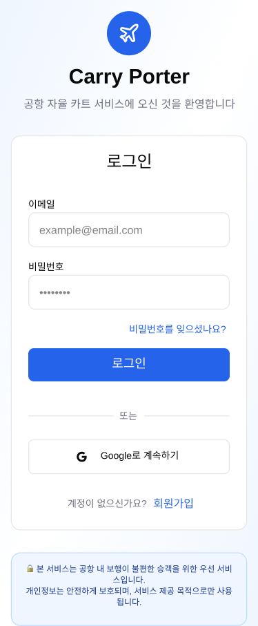
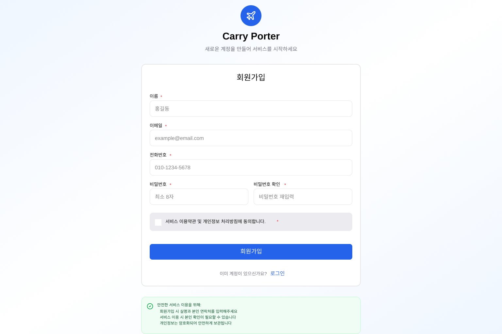
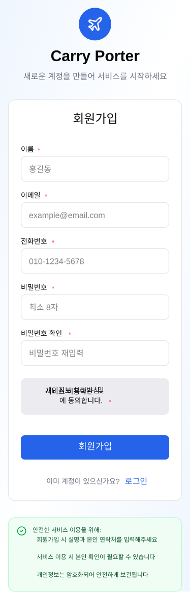
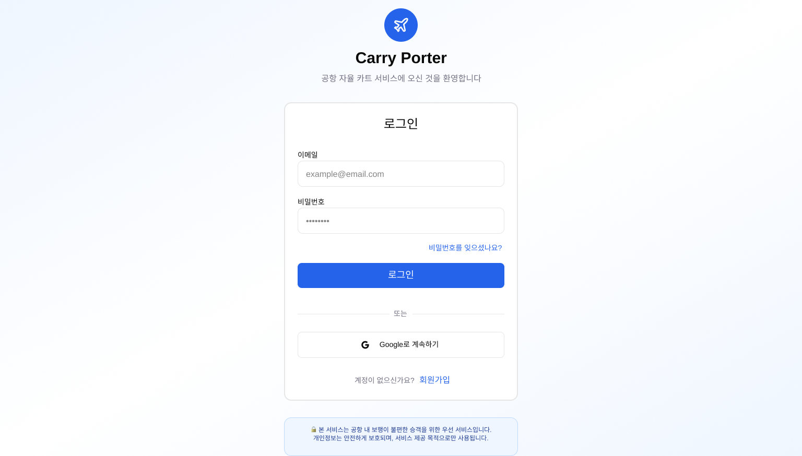

# 사용자용 목업

## 로그인

사용자가 서비스에 로그인하는 화면입니다.

---

## 로그인 실패 시

로그인 실패 시 표시되는 화면입니다.

---

## 회원가입

신규 사용자가 회원가입하는 화면입니다.

---

## 회원가입 실패 시

회원가입 실패 시 표시되는 화면입니다.

---

## 메인화면 초기 화면

사용자가 로그인 후 처음 보게 되는 메인화면입니다.

---

## 메인화면 - 카트 재호출 시

카트를 재호출했을 때의 메인화면입니다.

---

## 본인 확인

본인 확인 절차를 진행하는 화면입니다.

---

## 카트 배정 중

카트가 사용자에게 배정되는 과정을 보여주는 화면입니다.

---

## 카트 이동 중

카트가 사용자에게 이동하는 중인 상태를 보여주는 화면입니다.

---

## 카트 도착

카트가 사용자 위치에 도착했을 때의 화면입니다.

---

## 짐 싣기

사용자가 카트에 짐을 싣는 과정의 화면입니다.

---

## 짐 보관 있을 시

보관함에 짐이 있는 경우의 화면입니다.

---

## 짐 보관 없을 시

보관함에 짐이 없는 경우의 화면입니다.

---

## 보관함에 짐이 있고, 카트도 나한테 없는 상태

보관함에 짐이 보관되어 있고, 카트는 사용자에게 없는 상태를 보여주는 화면입니다.

---

## 보관함에 짐이 없고 카트도 나한테 있는 상태

보관함에 짐이 없고, 카트가 사용자에게 있는 상태를 보여주는 화면입니다.

---

## 카트 보관함 이동

카트가 보관함으로 이동하는 상태를 보여주는 화면입니다.

---

## 보관 완료 알림

짐 보관이 완료되었을 때 표시되는 알림 화면입니다.

---

## 반납 버튼 클릭

사용자가 카트 반납 버튼을 클릭했을 때의 화면입니다.

---

## 카트 반납 완료

카트 반납이 완료되었을 때 표시되는 화면입니다.
