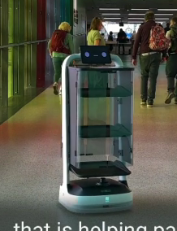

# 바리바리 사례조사_기현

## **1. 자료 설명**

---

## **2. 자료 첨부**

---

- 아일랜드 - 더블린 공항
    
    [https://www.rte.ie/news/dublin/2024/0516/1449349-ai-robots-dublin-airport/](https://www.rte.ie/news/dublin/2024/0516/1449349-ai-robots-dublin-airport/)
    
    - 로봇
    
    
    
    - 검색대 옆 터치로 로봇 호출
    
    
    
    - 충전소
    
    
    
    ### 기능
    
    **보안검색 이후 구간에서 탑승 게이트까지 길 안내(동행 이동)**
    

- 와트 - 짐꾼 서비스(아파트)
    
    https://www.irobotnews.com/news/articleView.html?idxno=38075
    
    - 아파트 단지에서 입주민들을 위해 짐을 운반해 주는 '포터(짐꾼)' 로봇 서비스
    
    자동문, 엘리베이터를 제어하는 자율주행 로봇이다. 엘리베이터 내부나 좁은 복도에서도 원활한 이동이 가능한 ‘스워브 드라이브(Swerve Drive)’ 기술을 적용
    
    
    

- 락커를 로봇이 품는 모델
    
    [https://www.prnewswire.com/news-releases/ottonomy-announces-strategic-partnership-with-harbor-lockers-unlocking-access-to-100s-of-vendors-using-ottobot-lockers-its-newest-delivery-robot-302029876.html](https://www.prnewswire.com/news-releases/ottonomy-announces-strategic-partnership-with-harbor-lockers-unlocking-access-to-100s-of-vendors-using-ottobot-lockers-its-newest-delivery-robot-302029876.html)
    
    
    

- 스마트 패키지 락커
    
    
    [https://www.parcelpending.com/](https://www.parcelpending.com/)
    
    