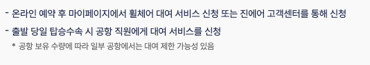
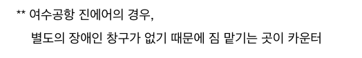
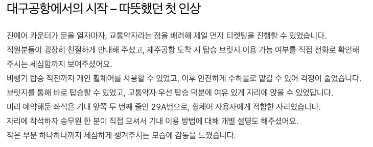
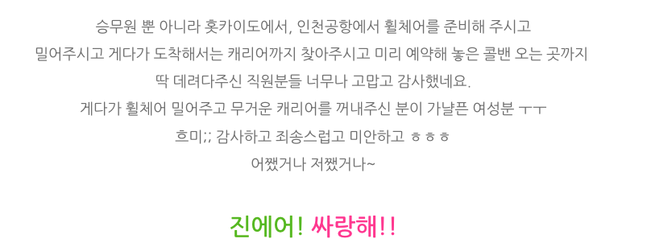
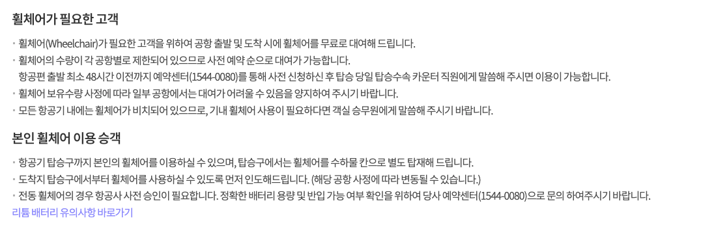
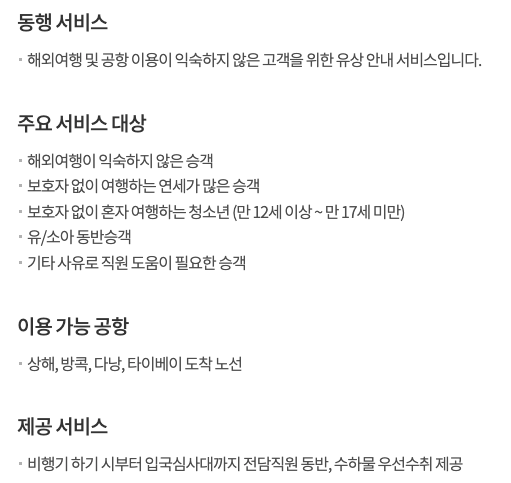
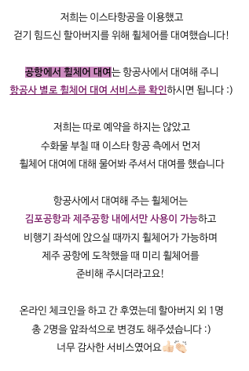
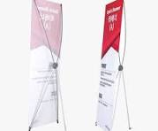

## 1. 자료설명

---

## ✈️ 1.1 진에어

### [**휠체어 대여 서비스**](https://www.jinair.com/ready/help/typeD)

- 단순 휠체어를 대여해주는 서비스만 존재. → 거동이 불편한 사람들 대상

### 후기

### [떨리는 첫 휠체어 제주도 여행 시작 (with 진에어 휠체어 서비스)](https://m.blog.naver.com/hyeon_seo_s2/223022307259)

- 별도의 장애인 창구 **없음**

### [휠체어 타고 떠난 엄마와 딸의 제주여행 - 진에어 탑승 후기](https://jini0122.tistory.com/entry/%ED%9C%A0%EC%B2%B4%EC%96%B4-%EC%97%AC%ED%96%89%EC%9E%90%EC%9D%98-%EC%A0%9C%EC%A3%BC-%EC%A0%95%EB%B3%B5%EA%B8%B0-%E2%80%93-%EC%97%84%EB%A7%88%EC%99%80-%ED%95%A8%EA%BB%98%ED%95%9C-2%EB%B0%95-3%EC%9D%BC%EC%A7%84%EC%97%90%EC%96%B4)

- 단순히 수하물을 맡겼다는 이야기만 있음

### [인천공항 홋카이도 진에어 비행기 탑승수속 승무원 이미지 휠체어 서비스 해외여행 다리 골절 대처법](https://blog.naver.com/lsy5088/223376282976)

- 여행 중 다리골절로 인한 휠체어 서비스 이용하신 분
- 진에어 휠체어 서비스 이용

- 캐리어를 직접 사람이 찾아주었다고 함

## ✈️ 1.2 이스타 항공

### [제공 서비스](https://www.eastarjet.com/newstar/PGWIM00002)

**[몸이 불편하신 고객]**

- 휠체어 제공 서비스

**[동행 서비스]**

- 대상이 공항이용이 익숙하지 않는 사람들 대상
- 장애인도 포함인지는 애매함

### [3대 가족 제주여행 ::1일차:: 김포공항(이스타항공-휠체어 대여) / 무지개렌트카 / 바다속고등어쌈밥 / 웨이뷰 협재바다 / 신창풍차해안도로 / 항해진미 / 서머셋 제주신화월드](https://m.blog.naver.com/kdy00703/223471101814)

- 단순 휠체어를 제공해주는 서비스지 수하물이나 짐을 대신 옮겨주지는 않는 듯 함.

## 📦 1.3 서비스 흐름

### 1.3.1 바리바리 호출 전

**[사용자 인증]**

- 바리바리를 이용하는 사용자를 구분 해야 어떤사람이 어떤 짐을 맡겼는지 추적가능 해야함
- 구현 방법
    1. ticket 기반
        - 간편하게 ticket 을 통해 사용자를 인증하는 방법
        - ticket 을 바코드 또는 OCR 기술을 통해 인식
    2. OAuth2 
        - kakao  oauth2 기반
        - 블랙리스트 관리 및 사용자 활동 추적하려면 이 방법 사용
    

### 1.3.2 바리바리 호출

**[바리바리 호출 가능 위치 확인하기]**

- 바리바리 호출 가능 지점에서 벽면 또는 특정 지점에 부착된 바리바리 QR Code 인식하기
    - 이런 x 배너 에 QR 및 문구 프린팅
    
    
    
- 해당 QR Code 인식하면 바리바리 웹 접속

**[바리바리 호출하기]**

- 가용할 수 있는 바구니가 있는지 확인
    - 없으면 대기.
    - 대기열 끝날 경우 사용자에게 바리바리 배정 받을건지 확인
        - yes → 진행
        - no → main page 이동
- 서버에서 가용가능한 바리바리 중 하나를 사용자에게 배정.
- 배정된 바리바리는 기존 사용자가 사용하던 바구니가 있는지 확인
    - 없으면 새로운 바구니 받음
    - 있으면 사용자의 사물함에서 바구니를 꺼냄
- 바리바리 출발 알림
- 사용자가 위치한 구역으로 이동

### 1.3.3 바리바리 이동

**[바리바리 이동하기]**

- 바리바리는 지정된 경로를 따라 이동
    - 라인 트레이싱으로 구현
- 사람 또는 물체가 앞에 있을 경우 잠시 기다리며 비켜달라고 소리냄
    - 객체 탐지
    - tts
- 사용자 있는 구역에 올 경우 멈추고 도착 알림
- 사용자는 배정받은 바리바리의 번호를 보고 내 바리바리 확인
    - 바리바리 마다 고유 번호가 있어야 할 듯

### 1.3.4 바리바리에게 물건 맡기기

- 바구니 통째로 들고 튀면 무용지물
- 운반 로봇과 바구니를 결합해서 안풀리게 하고, 사용자가 비밀번호를 입력하거나, 운반로봇이 짐 보관소에 도착 후 짐을 내려놓을 때 결합이 풀리게끔 구현해야할 듯.
- 로봇 전체를 들고 튀려고 하면 자이로 센서 기반 흔들림 감지를 통해 경고음 발생 및 관리자에게 알림.

**[바리바리 비밀번호 설정하기]**

- 구현방법
    1. 바구니에 부착된 QR 을 인식하면 해당 바구니 비밀번호 초기화 
        - 바구니 QR 인식 → 폰으로 비밀번호 설정 사이트 진입 → 비밀번호 초기화
    2. ssafy 사물함 처럼 일회성 비밀번호 설정하게 하기 
    3. 자물쇠 직접 달기 …. (구림) 
    4. 안면인식, 여권 인식

**[바리바리에 물건 담기]**

- 비밀번호를 설정하면 바구니 열림
- 사용자는 물건을 담음
    - 사용자가 물건을 담지 않고 보내거나 단순히 점유하기 위해 물건을 담지 않고 그냥 보낼 수 있음
    - 악용 사례를 방지하기 위해 무게  측정
        - 바구니를 열기전 무게와 바구니를 닫을 시점의 무게의 차이가 없다면 바리바리는 돌아간 뒤 바리바리 및 바구니 사용자 지정 해제.
        - 물건을 담으면 (일부러 안담을수도) 사용자 소유의 바구니가 되는데 한사람이 악용하기 위해 점유할 수 있기 때문
    - 무게가 너무 가벼워 무게 센서 인식 불가능할 경우
        - 이를 방지하기 위해 카메라 센서를 통해 객체 탐지
        - 물건이 있으면 ok
        - 없으면 악용 → 해당 유저 black list 등록
        - 바구니 내부가 어두울 경우 적외선 카메라 (IR CAM) 또는 무게 센서 이용
    - 1차 검증 (무게) + 2차 검증 (카메라) 를 통해 짐 감지
    - 무게 0g 이고 카메라에 인식된 물체가 없을 경우 해당 사용자를 블랙리스트에 등록

**[바리바리 바구니 닫기]**

- 구현 방법
    1. QR 로 비밀번호 설정한 경우 web 상에 바구니 닫기 버튼 누르면 닫히고 잠기게끔
    2. ssafy 사물함 구현 → ssafy 사물함과 같은 방식으로 
    3. 자물쇠 직접 잠그기 …. 

### 1.3.4 바리바리 돌려 보내기

**[지정된 경로로 짐 보관소로 이동]**

- 특정 경로를 통해 바리바리가 짐이 담긴 바구니를 들고 짐 보관소 도착
- 사용자의 짐이 있을 경우 바구니를 특정 위치에 배치
- 사용자의 짐이 없을 경우 빈 바구니 보관소에 바구니 보관

## 🧺 1.4 운송로봇 과 바구니

- 어떤 모양?
- 바리바리 운반 로봇 → 물류 센터 로봇
    - 아마존 키바
        - https://www.facebook.com/thepicle/videos/amazon-kiva/554689731368485/

- 바구니
    - 아마존 키바 영상에 나오는 운반 로봇위 물건들이 바구니로 대체되면 어떨까?
    - 바구니에는 카메라 센서, 무게 센서 탑재
    - 잠금 장치도 탑재

## **2. 자료 첨부**

---